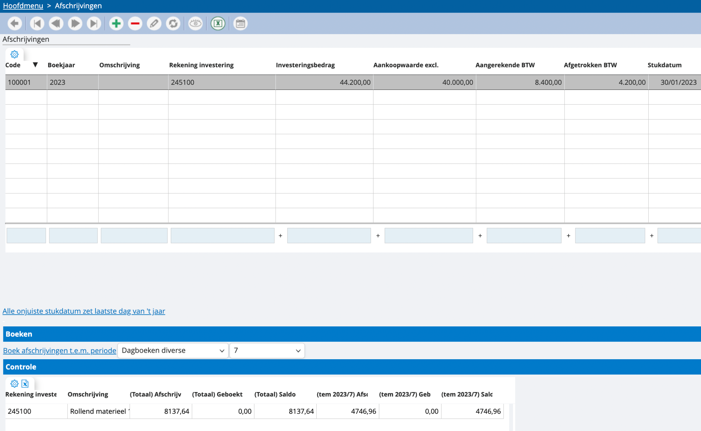
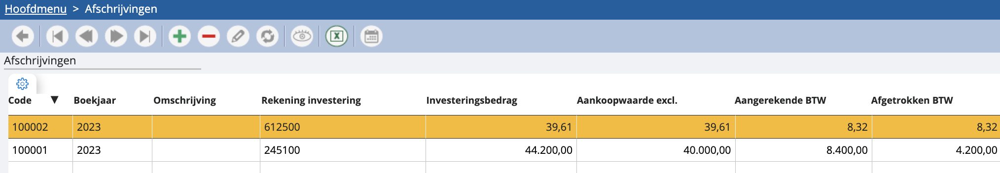

# Afschrijvingen boeken 

Je kan je afschrijvingen uiteraard nog per jaar boeken, maar dit kan ook per periode. Dit geeft je wat meer vrijheid om te spreiden in je cijfers. Afschrijvingen boeken door vanuit het hoofdmenu van de boekhouding naar ‘afschrijvingen’ te gaan: 

In de tabel bovenaan vinden we onze afschrijvingen terug. We kunnen er nu voor kiezen al deze afschrijvingen te boeken tot en met een bepaalde periode en in een bepaald dagboek diversen. Dit kan je aangeven onder ‘boeken’. 

Onderaan vind je een detail van wat er gedaan is en wat er nog moet gebeuren met de afschrijvingen. We overlopen even de kolommen van deze tabel: 

<u>(Totaal) afschrijving</u>
Het totale bedrag dat gedurende het huidige boekjaar moet worden afgeschreven voor de betreffende rekening . 

<u>(Totaal) geboekt</u>
Het totale bedrag dat reeds is afgeschreven voor de betreffende rekening  gedurende het huidige boekjaar.

<u>(Totaal) saldo</u>
Het totale bedrag dat nog moet worden afgeschreven voor de betreffende rekening gedurende het huidige boekjaar. Dit wordt berekend door het totale afschrijvingsbedrag te verminderen met het totale geboekte bedrag.

<u>(Tem) afschrijving</u>
Het totale bedrag dat nog moet worden afgeschreven voor de betreffende rekeningtot en met de huidige periode (tot de huidige datum).

<u>(Tem) geboekt</u>
Het totale bedrag dat reeds is afgeschreven voor de betreffende rekening  tot en met de huidige periode (tot de huidige datum).

<u>(Tem) saldo</u>
Het totale bedrag dat nog moet worden afgeschreven voor de betreffende rekening tot en met de huidige periode (tot de huidige datum). Dit wordt berekend door het totale afschrijvingsbedrag tot en met de huidige periode te verminderen met het totale geboekte bedrag tot en met de huidige periode.

*Let op: indien er iets mis is met een bepaalde afschrijving, dan zal het lijntje van de desbetreffende afschrijving in het oranje worden aangeduid:*

