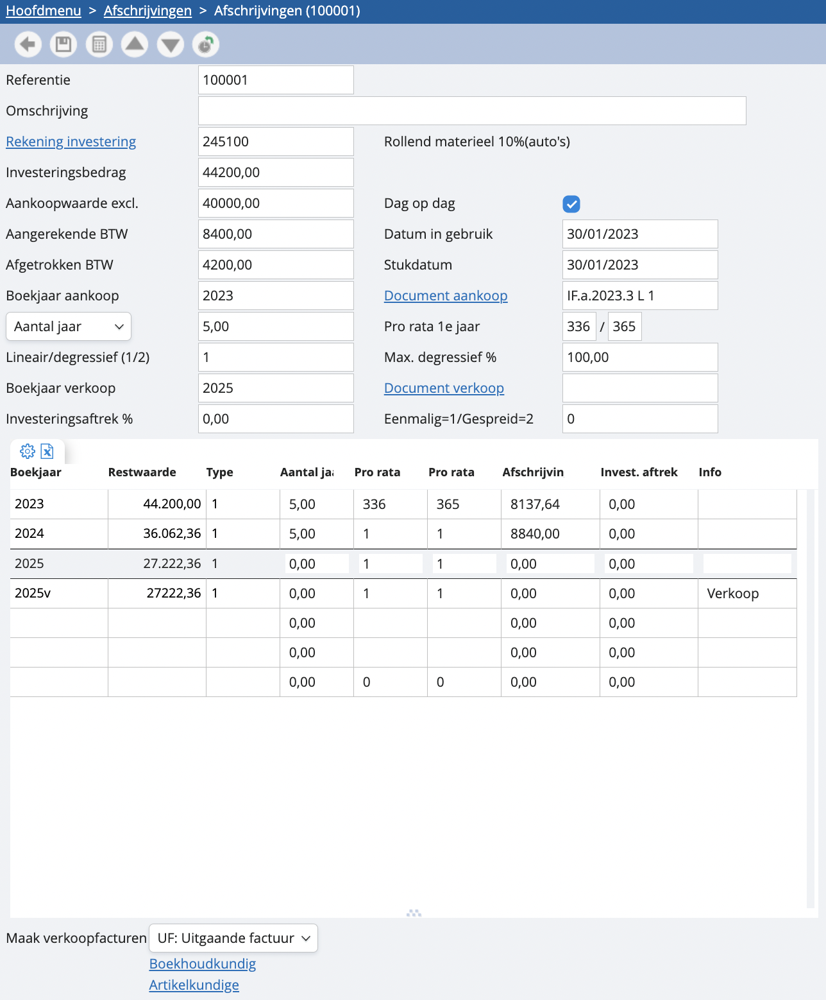

# Een investering verkopen

Het is in onze software mogelijk om rechtstreeks vanuit de afschrijvingsfiche de verkoop van een nog niet voltooide afschrijving te genereren. Hoe doe je dit? 

Je opent een afschrijvingsfiche. Vul onder ‘boekjaar verkoop’ het jaar aan waarin je de afschrijving zal verkopen. Het afschrijvingsbedrag wordt op ‘0’ gezet voor het verkoopjaar. De lijn voor de investeringsaftrek blijft echter nog in de afschrijvingsfiche staan, wat het saldo van de investeringsaftrek van alle volgende periodes vertegenwoordigt. Geef in het veld ‘document’ het factuurnummer van de verkoop in.

Als je klaar bent met het aanpassen van de afschrijving in functie, kun je onderaan de afschrijvingsfiche automatisch de verkoopfactuur genereren. Kies je dagboek en bepaal of je de verkoop boekhoudkundig of artikelkundig wil boeken. Kies voor ‘artikelkundig’ als je een verkoopfactuur wilt genereren. 