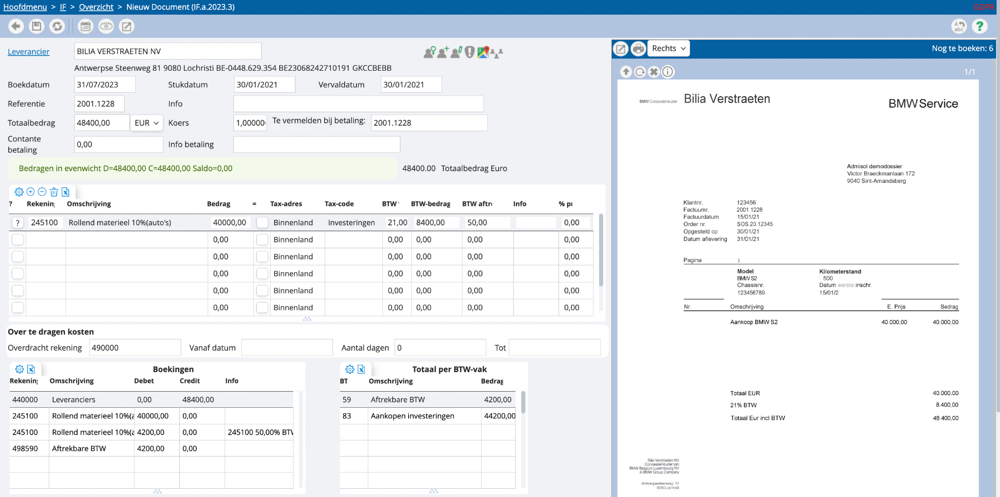
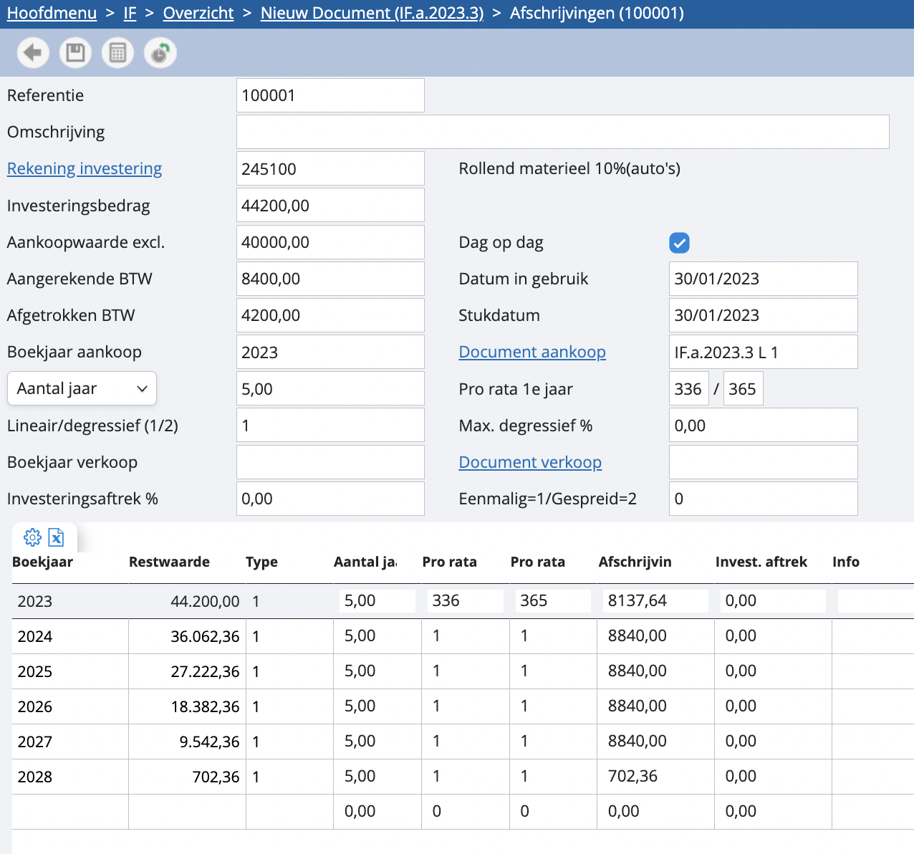

# Investering inboeken

We nemen een voorbeeld. Stel, we kopen een wagen aan en willen deze graag inboeken als investering en afschrijven over x-aantal jaar: 

We gebruiken in eerste instantie een inversteringsrekening, waardoor bij tax-code automatisch 'investering' wordt aangevuld.  Bij het gebruik van tax-code investeringen is er automatisch een activa fiche. Wenst u dit niet dan kan u dit wijzigen via Instellingen - BTW - Tax-code. Zodra je tevreden bent over de boeking, bewaar je, waarna je meteen zal worden doorgestuurd naar de afschrijvingstabel: 

We overlopen de verschillende onderdelen van dit scherm: 

<u>Referentie</u>
Automatisch volgnummer van de afschrijving.

<u>Omschrijving</u>
De benaming van het investeringsitem, automatisch overgenomen van de factuur en aanpasbaar.

<u>Rekening investering</u>
De boekhoudkundige investeringsrekening, automatisch overgenomen van de factuur en aanpasbaar.

<u>Investeringsbedrag</u>
Het totaalbedrag min de afgetrokken BTW.

<u>Aankoopwaarde excl.</u>
Het totaalbedrag min de aangerekende BTW.

<u>Aangerekende BTW </u>
Het BTW-totaal dat op de factuur is aangerekend.

<u>Afgetrokken BTW</u>
Het deel van de btw dat mag worden afgetrokken, bijvoorbeeld 50%.

<u>Boekjaar aankoop</u>
Het boekjaar waarin het investeringsitem is aangeschaft, automatisch overgenomen van de factuur, maar aanpasbaar.

<u>Afschrijvings % / aantal jaar</u>
Hier kan u kiezen of de duur van uw afschrijving bepaald wordt door het aantal jaar of door het percentage per jaar. Indien u hier “aantal jaar” kiest dan geeft u er naast bijvoorbeeld 5 jaar in. Kiest u percentage dan kiest u 20 voor 20% per jaar.

<u>Lineair/degressief (1 / 2)</u>
Keuze voor een lineaire of degressieve afschrijving. Bij degressieve afschrijving wordt het percentage verdubbeld tot het maximum.

<u>Boekjaar verkoop</u>
Geef hier het boekjaar van de verkoop in. De afschrijvingstabel wordt automatisch herberekend en een eventuele investeringsaftrek wordt getotaliseerd in het jaar van verkoop.

<u>Investeringsaftrek %</u>
Het percentage van de investeringsaftrek.

<u>Dag op dag</u>
Aanvinken als je wilt dat de afschrijving pro-rata wordt berekend in het eerste jaar van de afschrijving.

<u>Stukdatum</u>
De datum op de factuur.

<u>Document</u>
Verwijst naar het oorspronkelijke document.

<u>Pro rata 1e jaar</u>
Standaard ingesteld op 1 / 1, maar kan worden aangepast als u het eerste jaar meer of minder wilt afschrijven.

<u>Max. degressief %</u>
Het maximale afschrijvingspercentage in het geval van degressieve afschrijving. Dit wordt gebruikt om de afschrijvingen te beperken als de degressieve afschrijving hoger zou zijn dan de lineaire.

<u>Document (verkoopfactuur)</u>
Hier kunt u het factuurnummer van de verkoop ingeven.

<u>Eenmalig=1 / Gespreid=2</u>
Geef ‘1’ in voor een eenmalige aftrek, en ‘2’ voor een gespreide aftrek. Bij een eenmalige aftrek wordt de investeringsaftrek alleen in het jaar van aankoop berekend, op basis van het totaalbedrag. Bij een gespreide aftrek wordt de investeringsaftrek berekend op de afschrijving, voor alle jaren.

Als alles naar believen is ingevuld, kun je de tabel automatisch laten genereren door in de balk bovenaan op het icoontje van de rekenmachine te drukken. Als dit in orde is, kan je opslaan en je andere aankoopfacturen verder inboeken.  