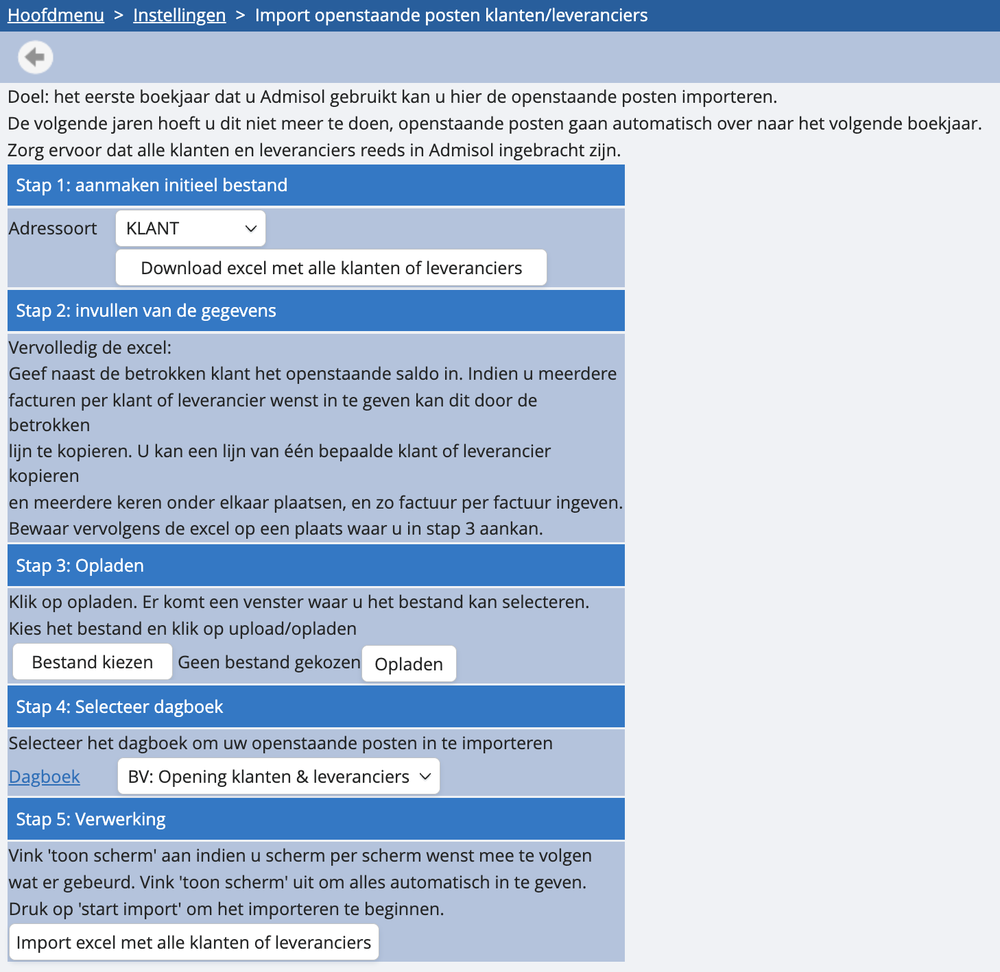

# Openstaande klanten en leveranciers

Er zijn twee mogelijkheden om openstaande klanten en leveranciers te importeren

1. **Werk met het diverse dagboek ‘BV: Opening klanten en leveranciers’**

Dit dagboek kan alleen worden gebruikt in periode ‘0’. Hoe ga je tewerk? 

In dit dagboek kan je op een vereenvoudigde manier documenten maken op klant- of leveranciersniveau. Wij zullen deze automatisch boeken op de rekening 400000 of 440000 en afboeken naar 499910 voor “beginsaldo klanten” of 499920 voor “beginsaldo leveranciers”.

Bij het inboeken van de beginbalans boek je de rekening 400000 af tegen 499910 en de rekening 440000 tegen 499920. 

<u>Meer weten over de diverse boeking ‘opening klanten en leveranciers’?</u>

2. **Importeer je openstaande klanten en leveranciers in mass**

Het eerste jaar dat je onze software gebruikt, kun je de openstaande posten importeren. De volgende jaren hoef je dit niet meer te doen: openstaande posten gaan dan automatisch over naar het volgend boekjaar.

Voor de import ga je via de instellingen naar ‘hulpprogramma's’, en vervolgens ‘import openstaande posten klanten/leveranciers’. Je volgt dan onderstaande stappen in het vervolgscherm: 

