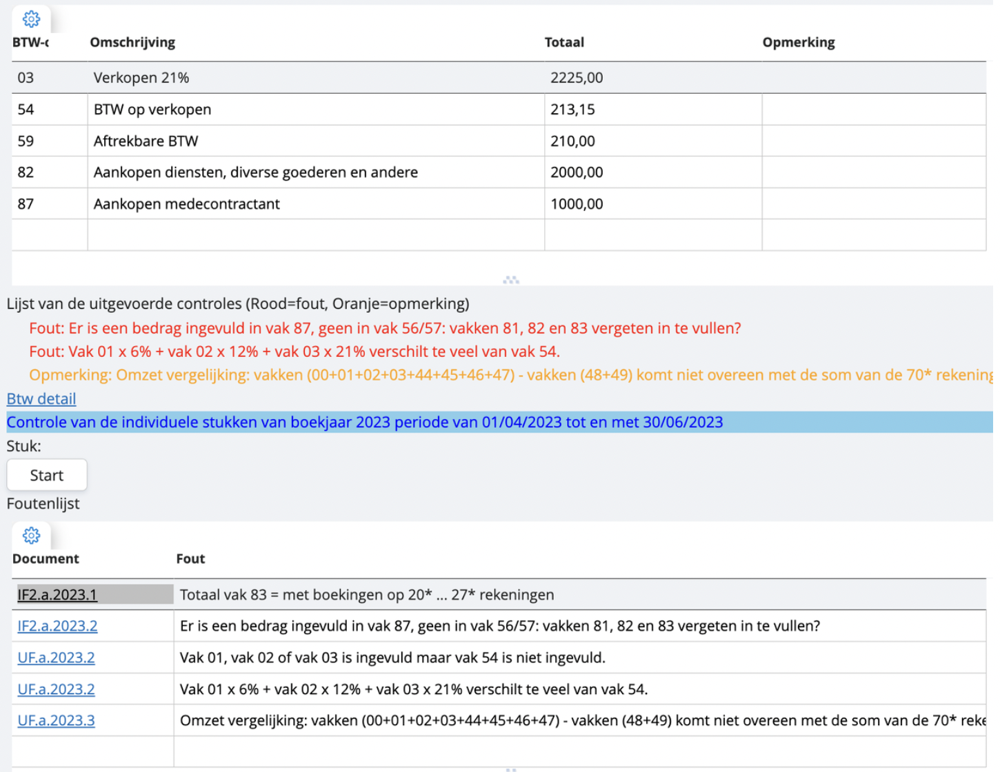

# Controleer je BTW-aangifte

In onze software zit ook een controleprogramma dat tijdens de aangifte controleert of er mogelijk fouten zitten in je BTW-aangifte. We simuleren een voorbeeld. Je gaat via 'lijsten' naar 'BTW-aangifte'. Je duidt aan welk kwartaal of welke maand je wil indienen en klikt bovenaan op het printer-icoontje om de aangifte te simuleren. Je krijgt zoiets te zien:

Boven aan het scherm vind je al je gebruikte BTW-vakken terug met de respectievelijke bedragen. Daaronder vind je een lijstje terug met opmerkingen bij je aangifte. Hierbij is de kleurcode van belang:

    • Rode tekst zijn fouten die je zullen tegenhouden je aangifte te vervolledigen;
    • Oranje opmerkingen zijn na te kijken, maar blokkeren niets;
    • Groene tekst betekent dat je in orde bent.

Deze opmerkingen zijn algemeen. Wil je nu graag zien op welke documenten ze betrekking hebben? Druk dan hieronder op 'start', en vervolgens zal een lijst verschijnen zoals onderaan het scherm hier. 

Van hieruit kan je eenvoudig naar de facturen navigeren die moeten worden herwerkt. Je werkt je rode opmerkingen één voor één weg, zodat je je aangifte kan indienen. 
