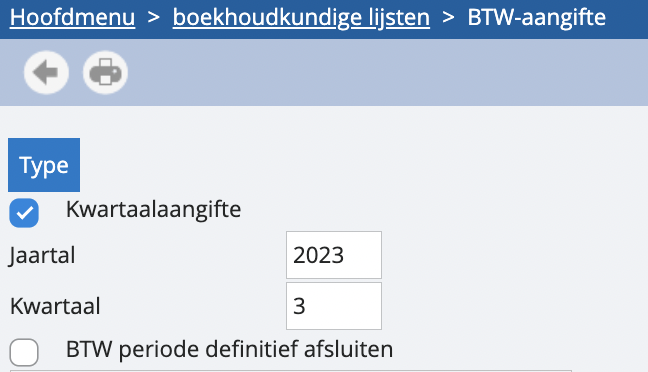
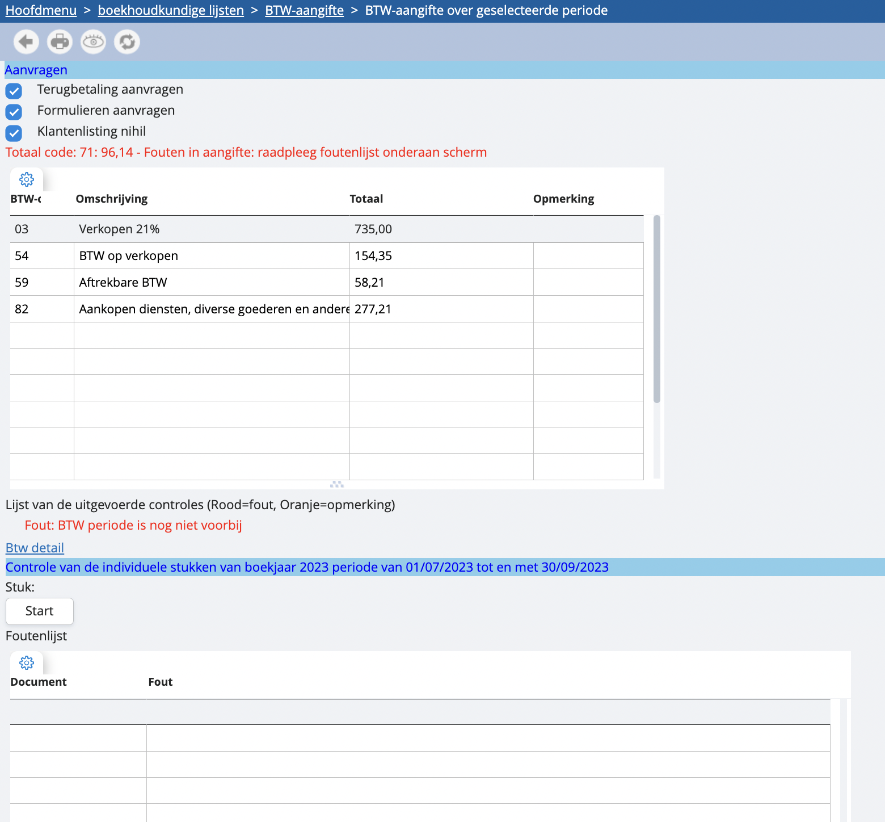
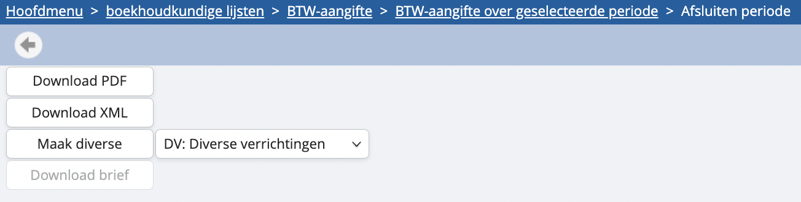
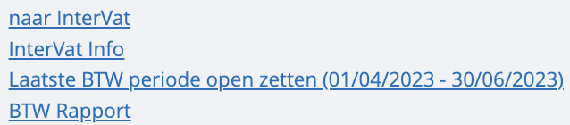

# Genereer je BTW-aangifte

Navigeer vanuit het hoofdmenu naar ‘lijsten’ en vervolgens naar ‘BTW-aangifte’. Vervolgens zal je onderstaand scherm te zien krijgen.

 

Hier kan je kiezen voor welke periode je de aangifte wenst te genereren: jaartal, en kwartaal of maand. In je ‘parameters dossier’ in de instellingen kan je aangeven of je kwartaal- of maandaangever bent. Dit zal bepalen of je hier maand of kwartaal te zien krijgt.

Je hebt ook de mogelijkheid om een BTW-periode ‘definitief af te sluiten’. Dit zal ervoor zorgen dat je bij het genereren van de aangifte ook een XML-bestand krijgt om op te laden in Intervat. Bovendien zal je voor de aangegeven periode geen wijzigingen meer kunnen uitvoeren die effect hebben op de BTW-vakken.

Als alles onder ‘type’ staat zoals je het wil, kan je klikken op het printer-icoontje. In het vervolgscherm krijg je een overzicht van je gebruikte BTW-vakken, zoals op de afbeelding hieronder. Je kan voor ieder gebruikt vak een detail opvragen met alle boekingen die hierop terechtgekomen zijn. Dit doe je door de lijn te selecteren en bovenaan op het oogje te klikken. Dit kan je zien als inzoomen op een gebruikt vak. 

Voor je afdrukt, kan je aangeven of je terugbetaling wenst en of je een lege klantenlisting meestuurt met je BTW-aangifte. 

*Let op: het onderdeel ‘terugbetaling aanvragen’ zal in het rood worden aangeduid indien vak 72 (door de staat te betalen) groter is dan vak 71 (aan de staat te betalen), omdat het dan wenselijk is de terugbetaling te vragen.*

 

Als je alles goed gecontroleerd en aangevuld hebt, kan je via het printer-icoontje de aangifte genereren. Indien je had aangeduid dat je de BTW-periode volledig wenst af te sluiten, zal je eerst de naam moeten opgeven van de aangever, en vervolgens krijg je onderstaand scherm te zien: 

Hier kan je ervoor kiezen om gewoon een PDF van je aangifteformulier te genereren of het XML-bestand voor Intervat. Je kan daarnaast ook de nodige diverse automatisch aanmaken vanuit dit scherm, zodat het te betalen of terug te trekken bedrag meteen naar je rekening courant wordt gestuurd. Accountancykantoren kunnen ook brieven genereren. 

Wil je nu rechtstreeks vanuit onze software naar Intervat gaan? Dat kan. Keer terug naar het basisscherm van de ‘BTW-aangifte’ dat je bereikt vanuit ‘lijsten’. Van hieruit kan je handige functies raadplegen: rechtstreeks naar Intervat gaan om je XML op te laden, de laatste en afgesloten periode terug openzetten om wijzigingen uit te voeren… 

Indien u hier niet de mogelijkheid ziet om een xml bestand te downloaden kan het zijn dat de accountant is ingesteld als ontvanger van de aangifte. In dit geval zal u wel de optie “opnemen in intervat” gezien hebben. Indien u dit wenst aan te passen zie dan: (Stukje btw aangifte via boekhoudkantoor onder “Instellingen - Parameters Dossier”.
