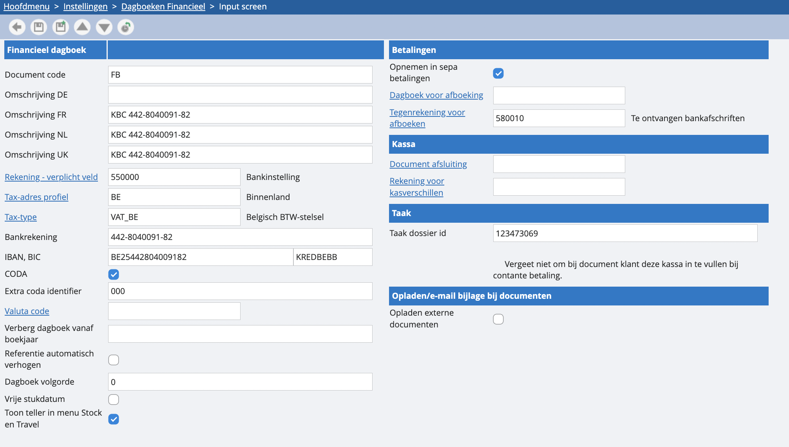

# Financieel

Standaard zitten er in onze software twee financiële dagboeken, eentje voor de bank en een voor de kas. Indien je bijvoorbeeld meerdere bankrekeningen hebt, is het wenselijk om meerdere financiële dagboeken te hebben. Dit doe je via ‘instellingen’, ‘dagboeken’, ‘financieel’. We overlopen het scherm eens: 

<u>Documentcode</u>

Een unieke afkorting van maximaal 4 tekens.

<u>Omschrijving DE/NL/FR/UK</u>

Een veld waarin je een beschrijving kunt invoeren voor elke taal die je hebt ingesteld.

<u>Rekening - verplicht veld</u>

Een verplicht veld voor de rekening van deze bank of kas. Dit betreft altijd een financiële centralisatierekening.

<u>Tax-adres profiel</u>

Een standaard voorstel bij een boeking. Als de klant of leverancier een andere instelling heeft, wordt dieklant gebruikt.

<u>Tax-type</u>

Het Tax-regime waaronder dit dagboek valt. In bijne alle gevallen mag dit op VAT_BE blijven staan. Enkel bij maatwerk oplossingen kan dit iets anders zijn.

<u>Bankrekening</u>

Een Belgisch bankrekeningnummer van 12 cijfers.Dit is het BBan formaat. U kan ook meteen IBAN/BIC invullen in de velden er onder.

<u>CODA</u>

Te activeren indien je de bank automatisch wenst te boeken met behulp van de CODA bankafschriften. 

<u>Extra coda identifier</u>

Sommige banken gebruiken hetzelfde Ibannummer voor verschillende rekeningen. Dit is bijvoorbeeld het geval bij de opticash rekeningen van ING. In dit geval zal er een extra code nodig zijn om de rekening te identificeren. Op die manier kunnen codabestanden in het juiste dagboek komen. Indien dit leeg is zullen alle codabestanden het gelinkte IBANnummer in hetzelfde dagboek komen. De standaardwaarde is 000 wat betekent dat er geen bijkomende code is.

<u>Valuta code</u>

Kies in welke valuta het financiële moet gebeuren.Indien dit leeg is dan zal Admisol er vanuit gaan dat u Euro gebruikt.

<u>Verberg dagboek vanaf boekjaar</u>

Wanneer je een dagboek vanaf een bepaald boekjaar niet meer gebruikt, kun je deze verbergen voor alle boekjaren die daarop volgen.

<u>Referentie automatisch verhogen</u>

Dit zorgt ervoor dat de referentie automatisch steeds met één verhoogd zal worden, bijvoorbeeld bij boekingen in het kasboek.

<u>Dagboek volgorde</u>

Hiermee kun je kiezen in welke volgorde je je dagboeken wilt zien. 10 komt eerder dan 20 bijvoorbeeld.

<u>Vrije stukdatum</u>

Hiermee zorg je ervoor dat de stukdatum niet kleiner hoeft te zijn dan de boekdatum.

<u>Opnemen in SEPA-betalingen</u>

Zorgt ervoor dat de betalingsbestanden worden opgenomen in het financieel dagboek. Zie ook Betalingsbestanden.

<u>Dagboek voor afboeking</u>

Hier geeft u het dagboek in waarop de tegenboeking zal gebeuren. Indien leeg zal Admisol het huidige dagboek gebruiken.

<u>Tegenrekening voor afboeken</u>

Hier geef je de kruispost in (bijvoorbeeld 580010 "te ontvangen bankafschriften KBC"). Zie ook Betalingsbestanden.
Enkel bij gebruik van SEPA. Als je dit leeg laat, zal er geen boeking plaatsvinden. Zie ook Betalingsbestanden.
