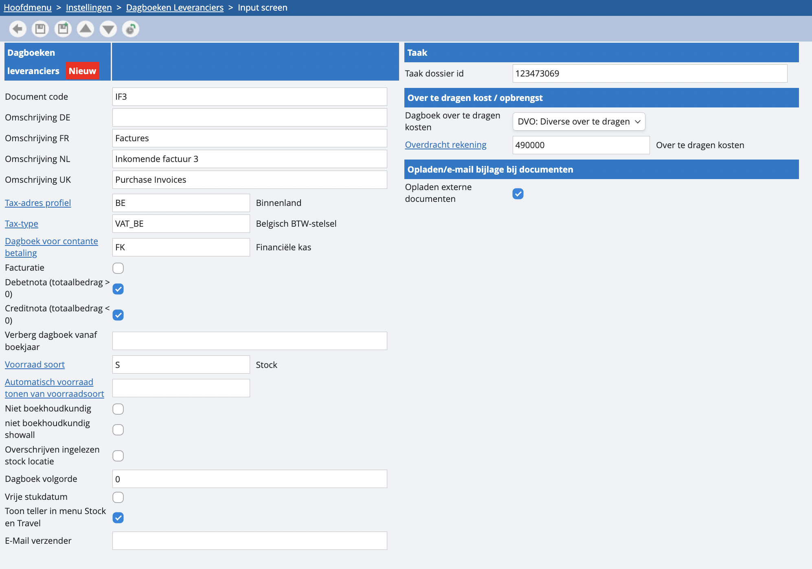

# Klanten en leveranciers

Standaard zetten we in ieder dossier vooraf één dagboek voor de inkomende facturen en één voor de uitgaande facturen klaar: respectievelijke codes IF en UF. Het dagboek voor uitgaande facturen vind je trouwens zowel terug onder de facturatie als onder de boekhouding: artikelkundig en boekhoudkundig. 

Wil je graag een aan- of verkoopdagboek bijmaken? Dat kan. Je navigeert in de instellingen naar dagboeken, dan klik je op ‘klanten’ of ‘leveranciers’, afhankelijk of je een ver- of aankoopdagboek wilt aanmaken. Een nieuw dagboek aanmaken doe je best door te vertrekken vanuit een bestaand dagboek en de documentcode aan te passen: 

 

<u>Documentcode</u>
Een unieke afkorting van maximaal 4 tekens.

<u>Omschrijving NL/FR/UK</u>
Een veld waarin je een beschrijving kunt invoeren voor elke taal die je hebt ingesteld. Bij een facturatiedagboek is dit ook de tekst op het document.

<u>Tax-adres profiel</u>

Een standaard voorstel bij een boeking. Als de leverancier een andere instelling heeft, wordt die van de leverancier of klant gebruikt.

<u>Tax-type</u>
Het Tax-regime waaronder dit dagboek valt. In bijne alle gevallen mag dit op VAT_BE blijven staan. Enkel bij maatwerk oplossingen kan dit iets anders zijn.

<u>Dagboek voor contante betaling</u>
Hiermee kun je bij het boeken van de factuur direct een contante betaling invoeren. De betaling wordt dan geboekt via het geselecteerde journaal.

<u>Facturatie</u>
Wanneer je dit aanvinkt, kun je via het dagboek een factuur aanmaken en wordt deze ook geboekt.

<u>Debetnota (totaalbedrag > 0) / Creditnota (totaalbedrag < 0):</u>
Je kunt een dagboek beperken zodat het alleen facturen of creditnota's kan bevatten.

<u>Verberg dagboek vanaf boekjaar</u>
Als je een dagboek vanaf een bepaald boekjaar niet meer gebruikt, kun je deze verbergen voor alle boekjaren die daarna komen.

<u>Voorraadsoort</u>
Indien bij de facturatie een voorraadteller moet worden bijgehouden. Enkel relevant voor stockdossiers.

<u>Niet boekhoudkundig</u>
Wanneer je dit niet aanvinkt, wordt het dagboek niet opgenomen in de verschillende boekhoudkundige lijsten en dus ook niet in de BTW-aangifte. Opmerking: dit is enkel zichtbaar in stockdossiers.

<u>Overschrijven ingelezen voorraadlocatie</u>
Enkel relevant voor stockdossiers. 

<u>Dagboekvolgorde</u>
Hiermee kun je kiezen in welke volgorde je je dagboeken wilt zien. Als je bijvoorbeeld je offertes voor je uitgaande facturen wilt zien, geef dan bij je dagboek ‘offerte’ bijvoorbeeld 10 in en bij ‘uitgaande factuur’ 20.

<u>Vrije stukdatum</u>
Hiermee kun je ervoor zorgen dat de stukdatum niet kleiner hoeft te zijn dan de boekdatum.