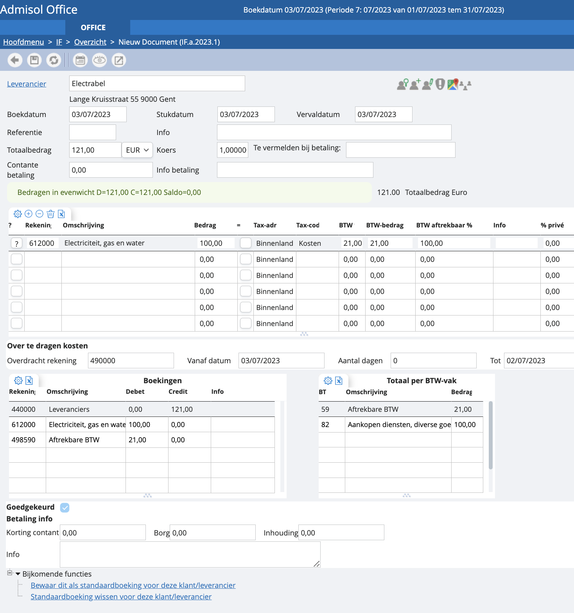
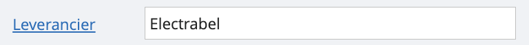
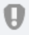
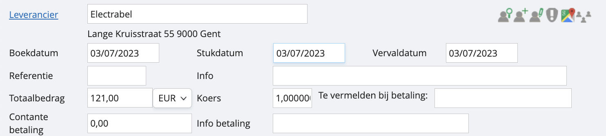
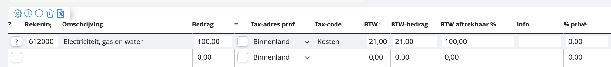
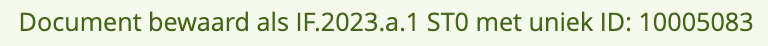
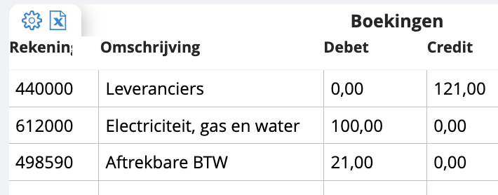
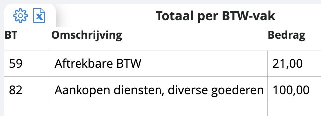

# Standaardscherm aankopen en verkopen boeken

We gaan het boeken in verschillende stappen doornemen:

## Keuze van klanten of leveranciers

Indien je leverancier al een leveranciersfiche heeft in je dossier, kan je gewoon de naam van de leverancier indrukken. In ons voorbeeld typen we bijvoorbeeld “ele”, en dan zullen wij je alle leveranciers voorstellen waar “ele” in de naam voorkomt. Je tikt de juiste keuze aan.

Je kan ook de hyperlink “leverancier” aanklikken zoals in het voorbeeld hierboven, dan kom je in de volledige leverancierslijst terecht. 

Enkele interessante toetsen: 

 Ga naar het overzicht van je klanten of leveranciers en kies hier je klant of leverancier. Je kan dit overzicht ook openen door gewoon op de hyperlink te klikken “klant” of “leverancier” zoals in het voorbeeld hierboven.

 Maak een nieuwe klanten- of leveranciersfiche aan. Als je deze fiche ten slotte opslaat, wordt het veld leverancier/klant ingevuld op de factuur.
Tip: als je de naam van een nieuwe klant of leverancier invult die niet wordt herkend door admisol, zullen we automatisch vragen of je naar het overzicht wilt gaan of een nieuwe klant wilt aanmaken.

 Hiermee ga je naar de fiche van de klant waar je de nodige aanpassingen kunt doen.

 Controleert de geldigheid van het BTW-nummer via VIES.

 Een directe link naar Google Maps

## Identificatiegegevens van het document

<u>Boekdatum</u>

Dit is automatisch de geselecteerde boekdatum. 

<u>Stukdatum</u>

Dit is de datum van het document, de factuurdatum dus. Dit kan een datum zijn uit een andere periode. De stukdatum kan nooit hoger zijn dan de boekdatum. 

<u>Vervaldatum</u>

Dit is de datum waarop de factuur betaald moet worden, automatisch berekend op basis van de instellingen voor het aantal dagen en het einde van de maand op de klanten- en leveranciersfiche.

<u>Referentie</u>

Factuurreferentie van de klant of leverancier, met controle op dubbele referenties. Als dezelfde referentie al in gebruik is, wordt dit gemeld, maar je kunt dezelfde referentie toch opnieuw gebruiken.

<u>Info</u>

Vrije tekst voor extra uitleg over de factuur. De ingevoerde tekst wordt weergegeven bij de tegenboekingen en kan per tegenboekingslijn worden aangepast.

<u>Totaalbedrag</u>

Het totaalbedrag van de factuur, inclusief BTW. Nadat je dit veld hebt ingevuld, worden de tegenrekeningen automatisch ingevuld en kan de BTW indien nodig worden uitgesplitst. 

<u>Valuta</u>

Je kunt hier aangeven in welke valuta de factuur is (Euro, dollar, etc.). Je kan zelf valuta’s toevoegen. Meer info?

<u>Koers</u>

Standaard staat de koers ingesteld op de koers van de gekozen valuta (euro = 1). Wanneer je met vreemde valuta werkt en dit aangeeft naast "totaalbedrag", wordt de koers automatisch aangepast.

<u>Te vermelden bij betaling</u>

Dit is de mededeling die bij de betaling aan de leverancier moet worden vermeld, of de mededeling die de klant bij betaling moet vermelden. Als je leverancier altijd dezelfde mededeling meegeeft, kun je deze standaard invoeren op de leveranciersfiche. Als het een gestructureerde mededeling betreft, moet je ze volledig invoeren, inclusief de plusjes.

## Tegenboeking

In de meeste gevallen hoef je hier niets meer te doen. Als je al een tegenrekening hebt ingevoerd bij de leverancier, wordt deze automatisch ingevuld. Als het een binnenlandse transactie betreft, is de BTW al gesplitst. Je kunt hier ook alles aanpassen. Je kunt regels toevoegen in de blanco regel, waarna er telkens een nieuwe blanco regel verschijnt.

<u>Rekening</u>

Dit wordt automatisch overgenomen van de klant- of leveranciersfiche, maar je kunt dit aanpassen. Als je een onjuist rekeningnummer invoert, wordt de lijst met rekeningnummers geopend waarin je kunt zoeken en/of een nieuwe rekening kunt aanmaken.

<u>Bedrag</u>

Dit is het (nettobedrag) van de tegenboeking.

<u>Tax-adres profiel</u>

Dit wordt overgenomen van de klant- of leveranciersfiche, maar kan handmatig worden aangepast, bijvoorbeeld als medecontractant. Meer info over tax-adres profiel?

<u>Tax-code</u>

Dit is het soort boeking en wordt al ingevuld via het boekhoudplan, maar kan hier worden aangepast (goederen, kosten, investeringen, enz.). Meer info over tax-code?

<u>BTW %</u>

Dit is het BTW-percentage en wordt al ingevuld via de tax-relaties, die de relatie tussen het land van de leverancier en het soort boeking weergeeft.

<u>BTW-bedrag</u>

Dit is het BTW-bedrag. Je kunt hier handmatig ingrijpen.

<u>BTW aftrekbaar %</u>

Dit is het gedeelte van de BTW die aftrekbaar is.

<u>Info</u>

Dit is de tekst die je eerder al bij de identificatiegegevens had ingevuld bij "info". Hier kan je dit eventueel lijn per lijn aanpassen. Het wordt afgedrukt in het grootboek.

<u>%Privé gebruik</u>

Dit is het percentage privé. Meer info over privé?

De eerder gebruikte boekingen en instellingen voor deze klant of leverancier worden getoond en ingevuld. Je kunt dan eenvoudig het bedrag invullen op de juiste regel. Je kan ook altijd een ‘standaardboeking’ hanteren.

## Bewaren

Je kan je boeking alleen bewaren als de bedragen, debet en credit gelijk zijn. Er zal een groene melding verschijnen als de bedragen in evenwicht zijn en je dus kan opslaan. Een rode melding krijg je als er nog geen evenwicht is. 

 Klik op de diskette-toets om je boeking op te slaan. Vervolgens zal je het nummer zien verschijnen waaronder het document wordt bewaard, bv. IF.2023.a.1. Meer info over documentnummers? 

## Overzicht boekingen

Je hebt altijd controle over wat je boekt. Hieronder zie je hoe de individuele regels daadwerkelijk worden geboekt.

## Overzicht BTW-vakken

Je behoudt altijd controle over de verwerking van de BTW. Je ziet meteen in welke BTW-vakken het wordt geboekt.

