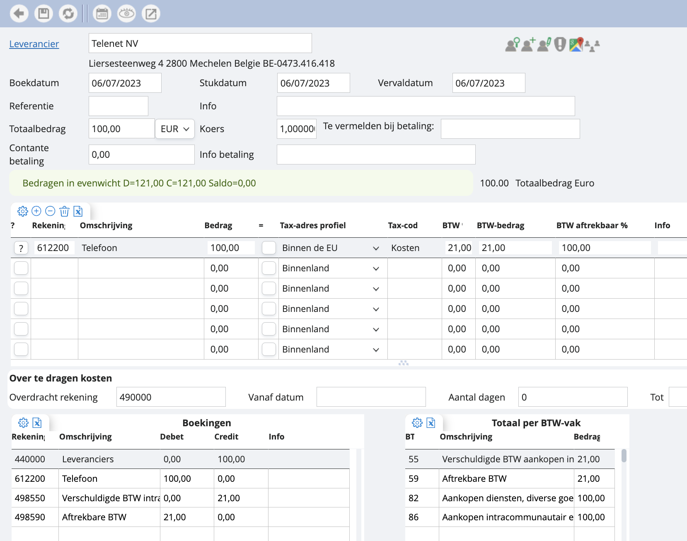

# Factuur binnen de EU

Ten slotte nog een laatste voorbeeld. Stel dat we te maken hebben met een leverancier niet uit het binnenland, maar binnen de EU. Dan verwerken we dit op bovenstaande manier. We passen het tax-adres profiel aan, en zo komt de kost op het correcte vak te staan: 86. 

*Let op: je moet hier een BTW-percentage meegeven. Deze wordt vaak op 0% gezet, maar moet wel degelijk op 21% staan, anders gebeurt de verlegging niet.*