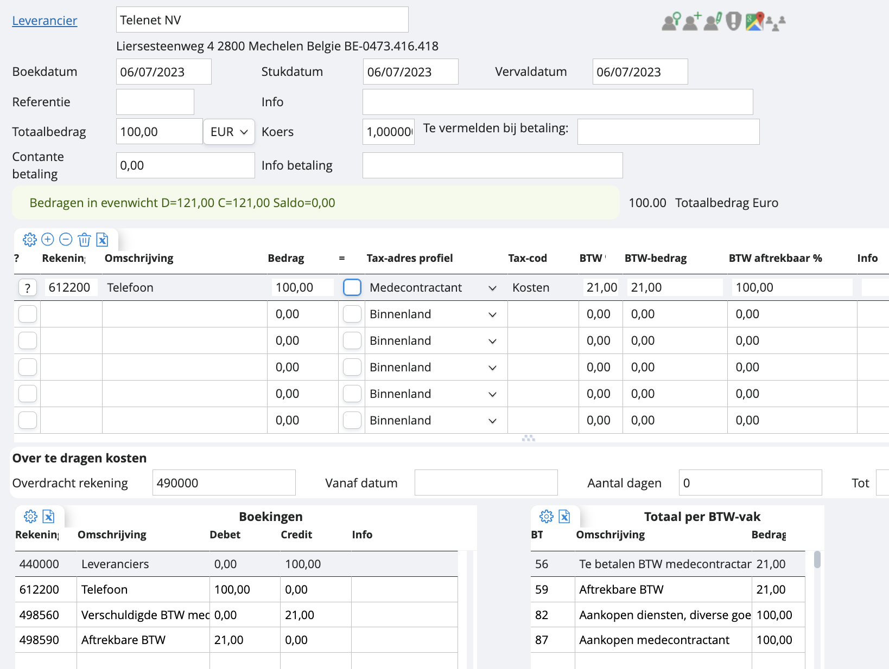

# Factuur medecontractant

Indien je te maken hebt met een factuur van een medecontractant, geef je dit aan bij het tax-adres profiel. Je ziet in je BTW-vak dat de kost correct naar vak 87 gaat.

*Let op: je moet hier een BTW-percentage meegeven. Deze wordt vaak op 0% gezet, maar moet wel degelijk op 21% staan, anders gebeurt de verlegging niet.*