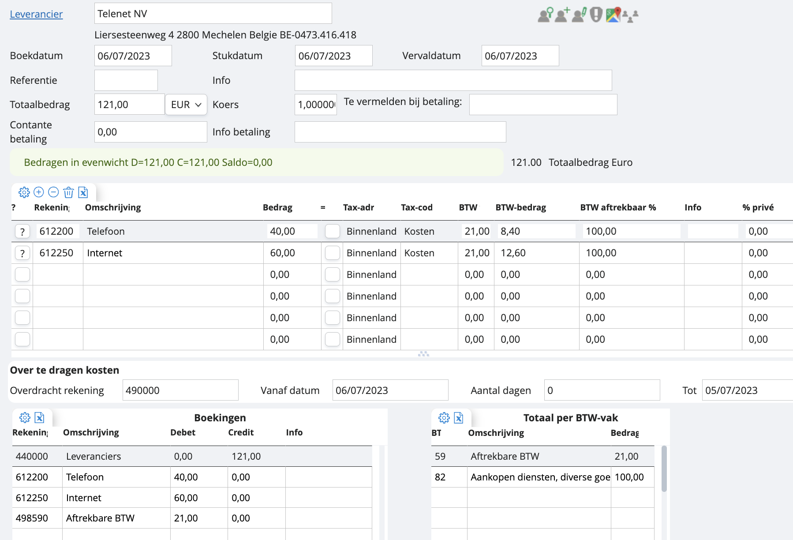

# Telenet met uitsplitsing telefoon en internet

Stel nu dat de factuur van Telenet niet louter betrekking heeft op telefoonkosten, maar ook op internet. Dan moet je splitsen over twee rekeningen. Als je bij ‘totaalbedrag’ 121 invult, zal onze software alles toeschrijven aan de rekening telefoon. 

Hoe voeg je de rekening ‘internet’ nu toe? In het veldje onder ‘612200’ vul je gewoon de rekening in die je zoekt, in dit geval dus ‘internet’ of ‘612250’. Je tikt de gewenste rekening aan. Het bedrag voor die rekening zal op 0 staan, dus vervolgens moet je de bedragen nog in evenwicht brengen, zoals vermeld op de factuur, in dit geval 40-60. 

*Tip: gebruik de salderingstoets! Dit is de blanco toets onder “=” in het raster. Als je het bedrag 60 bijvoorbeeld al had ingevuld voor de rekening internet, dan kon je aan de hand van de salderingstoets het bedrag voor de rekening telefoon automatisch laten berekenen. Dit berekent het open veld. *

Als je nu opslaat, zal je de eerstvolgende keer dat je een factuur van Telenet verwerkt, de twee rekeningen, telefoon en internet, voorgesteld krijgen. Indien je hier verder in wil gaan, kan je ook altijd gebruikmaken van de standaardboekingen. Meer weten hierover? 