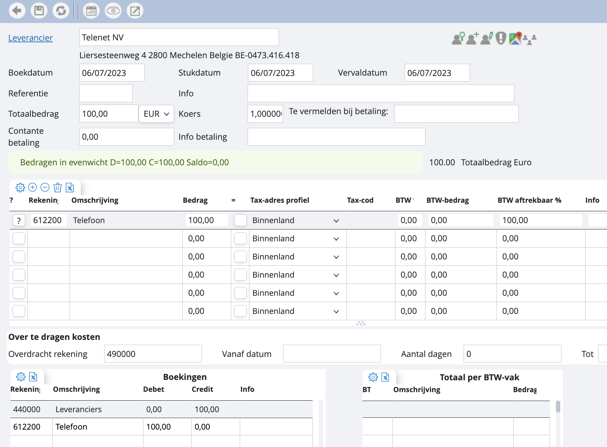

# Factuur zonder BTW

Stel nu dat we te maken hebben met een factuur zonder BTW, dan geven we dit aan zoals in het voorbeeld hierboven. Je wil in dit geval niet dat je kost in de BTW terechtkomt, dus je laat het vakje tax-code leeg. De BTW-vakken zullen vervolgens ook leeg blijven. 