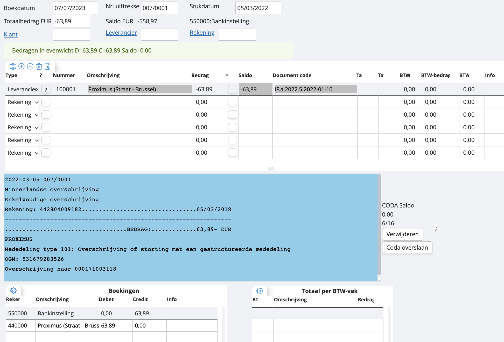
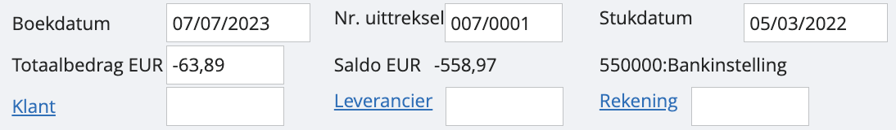
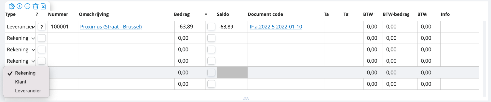
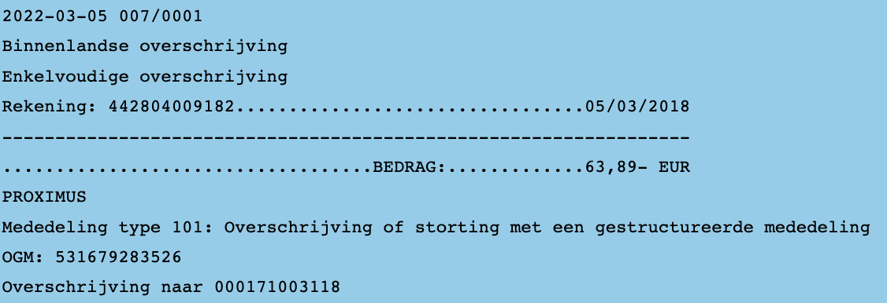

# Bank inboeken

We overlopen de verschillende onderdelen bovenstaand financieel boekingsscherm. Hier zijn we terechtgekomen door een financieel dagboek te openen en vervolgens op de groene plus te klikken. 

<u>Boek- en stukdatum</u>
De boekdatum is automatisch de geselecteerde boekdatum die wordt genomen. De stukdatum kan dezelfde zijn als de boekdatum, maar niet per se. Meer weten over het verschil tussen de boek- en stukdatum?

<u>Nr. uittreksel</u>
Dit is het nummer van het afschrift, zodat je het gemakkelijk kunt identificeren.

<u>Totaalbedrag</u>
Dit is het bedrag zoals vermeld op het bankuittreksel. Gebruik een positief bedrag voor ontvangen bedragen en een negatief bedrag voor bedragen die van de rekening zijn afgeschreven. Bijvoorbeeld: "-63,89".

<u>Saldo</u>
Controleer het saldo. Bij het aanmaken van een nieuwe bankverrichting wordt het huidige banksaldo weergegeven. Het saldo staat momenteel op "-558,97". Na het opslaan zal er nog eens “-63,89” worden afgetrokken. Je saldo wordt verrichting na verrichting verwerkt. Wil je weten hoe je je beginsaldo aanpast?

Hieronder kunnen we de transactie toeschrijven aan een klant, leverancier of rekening. Je kan dit voor de volledige transactie doen in de velden bovenaan, of je kan dit lijn per lijn aanpassen in de kolom ‘type’. 

<u>Klant</u>
Als het bedrag betrekking heeft op een klant, voer dan een deel van de naam van de klant in bovenaan. Alle openstaande documenten voor deze klant zullen worden weergegeven in het overzicht. Kies dan zelf waaraan je het bedrag wil toeschrijven. 

<u>Leverancier</u>
Als het bedrag betrekking heeft op een leverancier, voer dan een deel van de naam van de leverancier in, bijvoorbeeld "proxi". Alle openstaande documenten voor deze leverancier worden weergegeven in het overzicht. 

<u>Rekening</u>
Als het bedrag noch betrekking heeft op een klant, noch op een leverancier, voer dan de relevante rekening in. 

Net daaronder vind je een blauw kader terug. Dit kan gevuld zijn of niet. Als je werkt met automatische instroom van CODA-bestanden in je dossier, kan er informatie instaan over de verrichting zoals hierboven. In dat geval zal ons systeem op basis van referentie en bedrag zoeken naar overeenstemmende elementen in je dossier.

Mocht je toch manueel de bank inboeken, dien je gewoon een bedrag in te geven, en het toe te schrijven aan een leverancier, klant of rekening. 