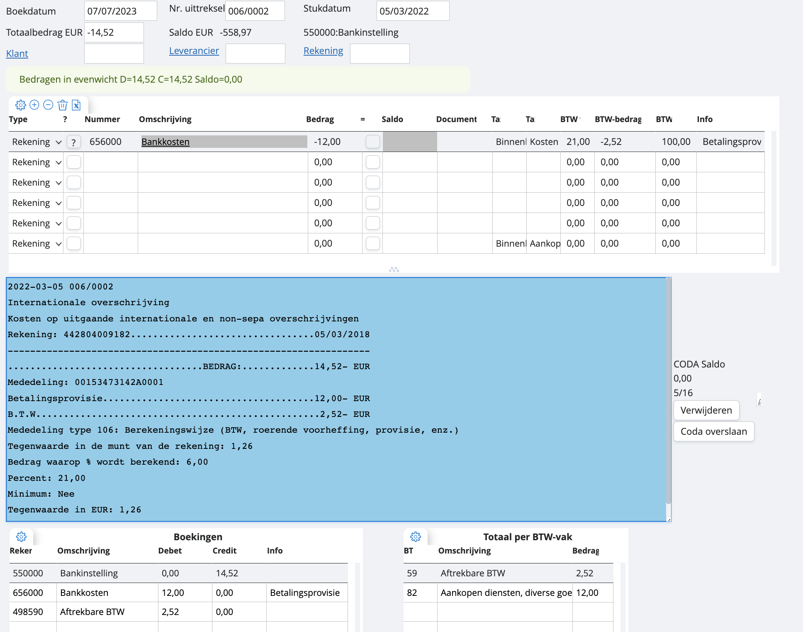

# Financiële boeking met BTW

In het voorbeeld hierboven hebben we te maken met een financiële boeking met BTW. In dit geval zal de tax-code moeten worden aangevuld, opdat het in de correcte BTW-vakken terechtkomt. 

Let op: hier kan het zijn dat bij de CODA-verwerking het bedrag niet meteen wordt toegeschreven aan de rekening ‘bankkosten’. Dan zal je dit te zijn krijgen zoals hier onder, een lijntje waar de maatstaf van heffing en BTW al wel correct worden uitgesplitst: 

Het is aan jou om in het oranje kader de correcte rekening toe te voegen.
