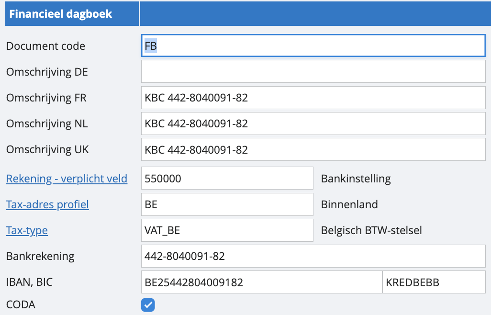
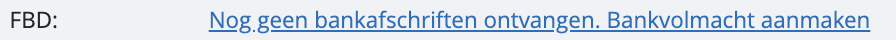

# Financiële dagboeken maken en CODA’s aanvragen

In onze software bieden we ondersteuning aan voor het importeren van bankafschriften voor volgende banken:

KBC
CBC
Fortis
Fintro
ING
Belfius
Bank Van Breda
Recordbank
Bpost
Nagelmackers
Crelan
Beobank

De bank stuurt de bankafschriften elke nacht naar ons, en wij verwerken deze de volgende werkdag vóór 12:00 uur 's middags.

Nu, hoe vraag je de CODA’s aan? 

Navigeer vanuit ons hoofdmenu naar ‘instellingen’, naar ‘dagboeken’ en ten slotte naar ‘financieel’. Van hieruit kun je eenvoudig een nieuw dagboek aanmaken om je bank te koppelen. Voer je IBAN in en vink “CODA” aan: 

Als dit gebeurd is, sla je op en keer je eenmaal terug naar je lijst met alle financiële dagboeken in je instellingen. Onderaan zal je de link zien staan om je volmachtdocument te downloaden voor de bank. Zodra de aanvraag rond is en de CODA’s dus instromen, zal deze link vanzelf verdwijnen: 

Klik op de link. Vervolgens ontvang je een pdf-document. Volg de instructies die hierop staan, die kunnen verschillend zijn per bank.

Zodra de bank de CODA-berichten naar je dossier doorstuurt, zullen wij je hierover per e-mail informeren.