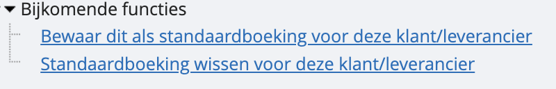

# Standaardboekingen

Tijdens het boeken krijg je altijd een boekvoorstel, gebaseerd op je eerder gebruikte rekeningen, BTW-tarieven, tax-codes, etc. voor de geselecteerde klant of leverancier waarvoor je een boeking wil doen.

Als je wilt, kun je ook een standaardboeking maken. Dan zullen we in de toekomst louter de lijntjes tonen die jij opslaat als standaardboeking. Hoe ga je tewerk? Je vult alles in het raster in zoals je het in de toekomst te zien wil krijgen:

- Wis of maak boekingsregels
- Zet de tax-codes zoals je ze wil
- Pas het percentage aftrekbare BTW aan
- Pas het percentage privégebruik aan
- Vul indien nodig een bedrag in

Bewaar deze standaardboeking door onderaan bij de bijkomende functies te klikken op de regel "bewaar dit als standaardboeking voor deze klant/leverancier". Je zal in de toekomst enkel de gewenste regels te zien krijgen.

*Let op: Als je terug wilt naar het standaardsysteem, kun je de standaardboeking eenvoudig wissen. Klik onderaan de boeking op "Standaardboeking wissen voor deze klant/leverancier".*

