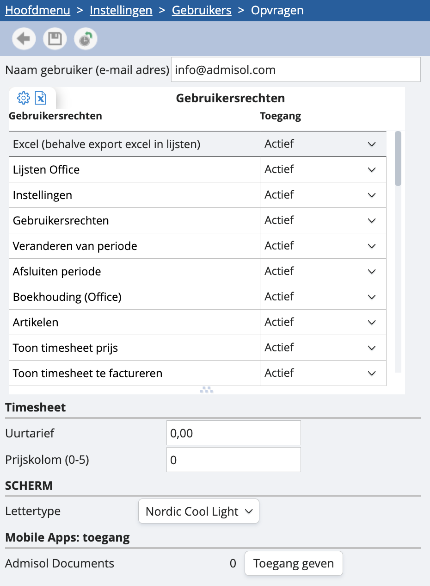
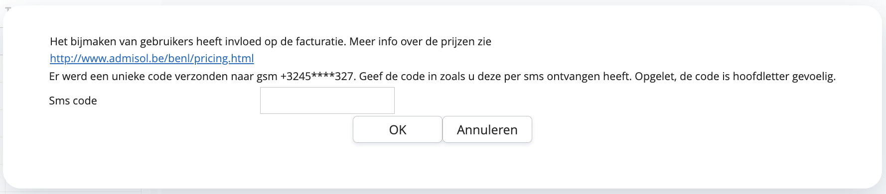

# Gebruikers

Vanuit het menu 'dossier instellingen' in ‘instellingen’ navigeer je naar ‘gebruikers’. Hier krijg je een lijst met alle gebruikers van je dossier. Je dubbelklikt om een bestaande gebruiker te openen, of je drukt op de groene plus om een nieuwe aan te maken. 

## Nieuwe gebruiker maken

In het overzicht van je bestaande gebruikers kan je door op de groene plus te klikken een nieuwe aanmaken. Hoe ga je in bovenstaand vervolgscherm verder tewerk? 

<u>Naam gebruiker</u>

Hier vul je het e-mailadres in van de nieuwe gebruiker.

<u>Gebruikersrechten</u>

Je kunt de gebruiker toegang verlenen of ontzeggen tot bepaalde opties. Indien alle opties uitgevinkt zijn, heb je deze situatie: 

- Excel: de gebruiker kan geen Excel-export downloaden van de rasters.
-  Lijsten: de gebruiker heeft geen toegang tot de lijsten (via hoofdmenu > lijsten).
-  Instellingen: de gebruiker heeft geen toegang tot de instellingen.
-  Gebruikersrechten: de gebruiker heeft toegang tot de instellingen, maar kan de gebruikersrechten niet aanpassen.
-  Veranderen van periode: de gebruiker kan niet van periode veranderen.
-  Afsluiten periode: de gebruiker kan de periodes niet afsluiten.
-  Boekhouding: de gebruiker heeft geen toegang tot Admisol Office.
-  Artikelen: de gebruiker heeft geen toegang tot de artikelen.
-  Toon timesheet prijs: de gebruiker kan de aangerekende prijzen niet zien in de timesheets.
-  Toon timesheet te factureren: de gebruiker kan geen timesheets factureren (vanuit het hoofdmenu).
-  Bedrijfsanalyse: de gebruiker heeft geen toegang tot de module bedrijfsanalyse (vanuit hoofdmenu > financieel beheer > analyse).
-  Klanten: de gebruiker heeft geen toegang tot de klantenlijst.
-  Leveranciers: de gebruiker heeft geen toegang tot de leverancierslijst.
-  Rekeningen: de gebruiker heeft geen toegang tot de lijst met boekhoudkundige rekeningen.
-  Valuta: de gebruiker kan geen nieuwe valuta’s aanmaken.
-  Prijsafspraken: de gebruiker heeft geen toegang tot de instellingen van prijsafspraken. 
-  Margeberekening stock: de gebruiker kan de marges niet zien.
-  E-mail document: de gebruiker kan geen mails versturen vanuit onze software.
-  Menu extra stock: de gebruiker heeft geen toegang tot stock.
-  Timesheets alle gebruikers zichtbaar: de gebruiker kan louter de timesheets zijn van de dossiers waarvoor hij verantwoordelijk is.
-  Sepa proposal toegang: de gebruiker kan geen betalingen bekijken.
-  Mag betalingsbestanden maken: de gebruiker kan geen betalingen uitvoeren. 
-  Lijst input scherm timesheet
-  Financieel beheer: de gebruiker heeft geen toegang tot het financieel beheer.  
-  Beheer: de gebruiker heeft geen toegang tot het beheer in de stock.
-  Configureer grid: de gebruiker kan de opbouw van de rasters niet wijzigen.
-  Enkel eigen dossiers zichtbaar: dit is interessant voor accountantskantoren, de gebruiker krijgt enkel de dossiers te zien die aan hem zijn toegewezen. 
-  Webshop: de gebruiker heeft geen toegang tot de module webshops.
-  Forfait: de gebruiker heeft geen toegang tot de module voor forfaits. 
-  Velden configureren voor dossiers
-  Velden configureren voor gebruiker
-  Cashflow planning: de gebruiker heeft geen toegang tot de module cashflow planning in financieel beheer.
-  Domiciliëring: de gebruiker heeft geen toegang tot de module domiciliëring in financieel beheer.
-  Betalingsherinnering: de gebruiker heeft geen toegang tot de module betalingsherinneringen in financieel beheer. 
-  Batch documenten verwerken: de gebruiker heeft geen mogelijkheid om documenten in mass door te pushen in de stock module.
-  Besteloverzicht
-  Interactieve lijsten: de gebruiker heeft geen toegang tot de interactieve lijsten via financieel beheer en lijsten. 
-  Afpuntingen: de gebruiker heeft geen toegang de module afpuntingen. 
-  Zoek op bedrag: de gebruiker heeft geen optie om in zijn dossier te zoeken naar een bedrag.
-  Veld totaalbedrag boven aan een document tonen
-  Overzicht kost per dossier per jaar
-  Lijst enkel openstaande posten 
-  Scherm openstaande posten
-  Bijkomende functies: de gebruiker heeft geen toegang tot de bijkomende functies.

<u>Uurtarief</u>

Hier kun je per gebruiker een uurtarief invoeren. Via prijsafspraken kun je dit tarief toepassen bij facturatie en timesheets.

Zodra je de nieuwe gebruiker bewaart, krijg je onderstaand bericht: 

*Een gebruiker aanmaken heeft altijd invloed op de facturatie en gaat gepaard met extra kosten. Om te voorkomen dat je per ongeluk een gebruiker aanmaakt, wordt er een sms-code naar je mobiele telefoon verzonden.*

Als je bevestigt, zal de nieuwe gebruiker een e-mail ontvangen met een registratiemail. De registratie kan alleen worden voltooid door op de link in deze e-mail te klikken. Als je de e-mail niet hebt ontvangen, controleer dan je spam-map.

