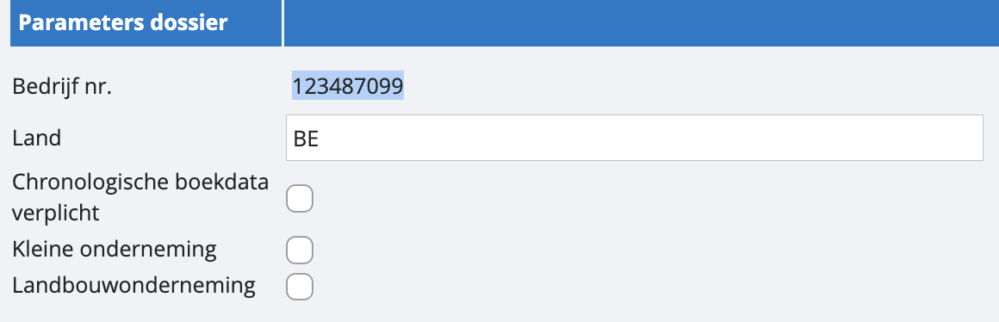
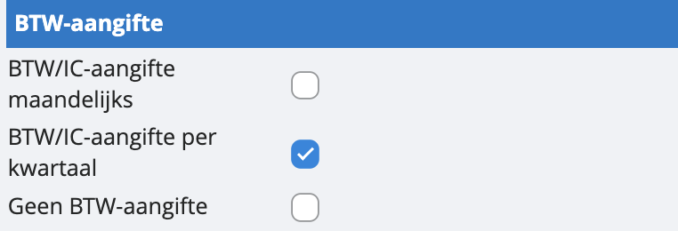
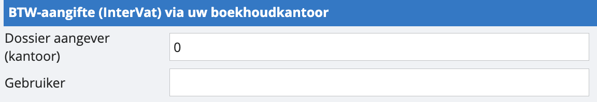
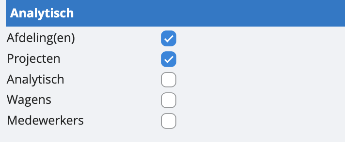
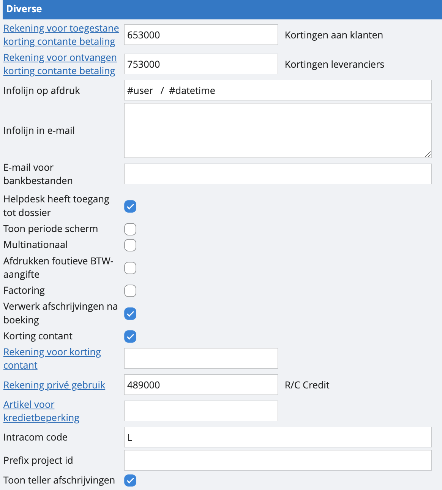
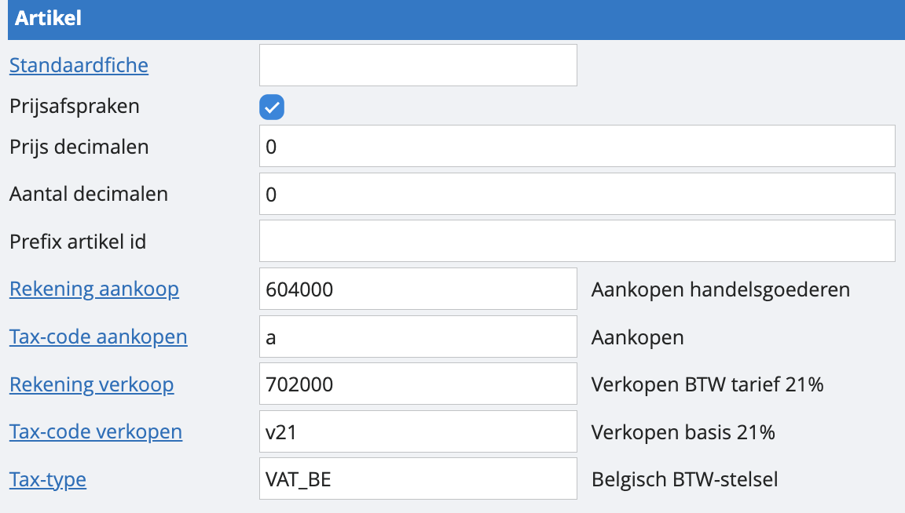
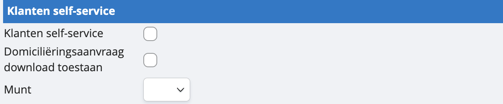
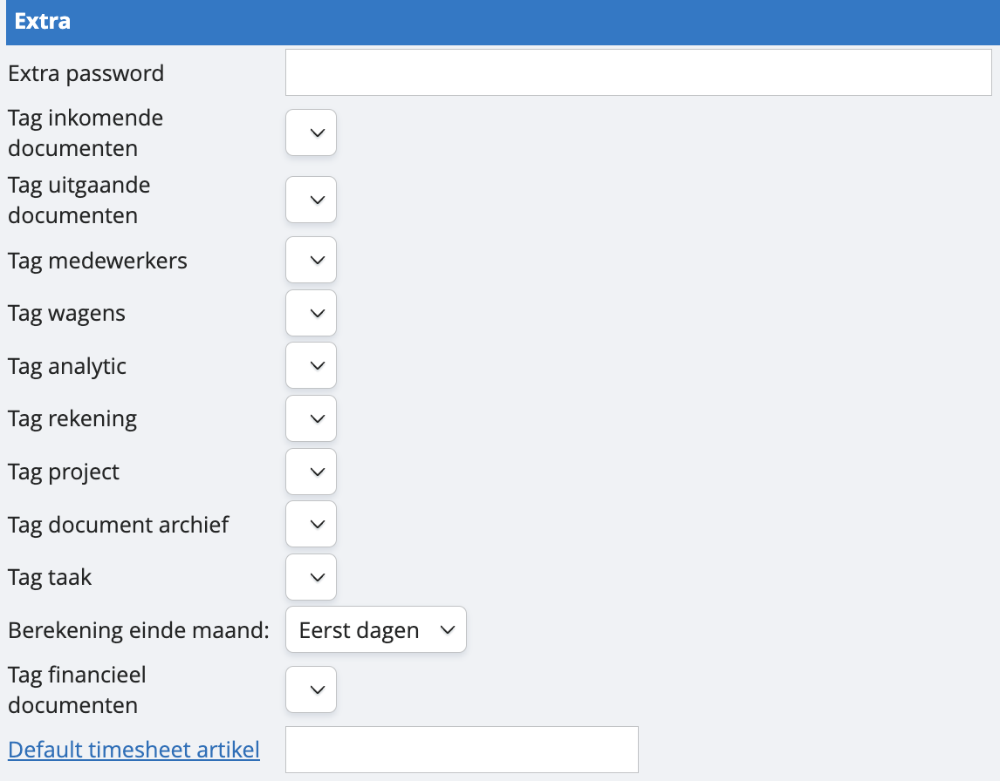
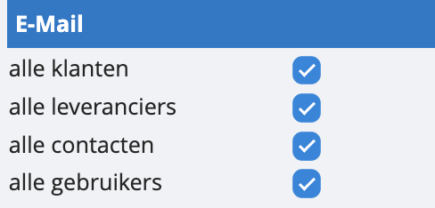
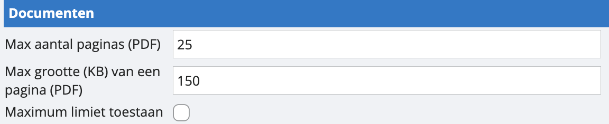

# Parameters dossier

## Parameters dossier

<u>Bedrijfsnummer</u>

Dit is je interne dossiernummer bij ons.

<u>Land</u>

Dit moet blijven op ‘BE’ voor de Belgische BTW-instellingen.

<u>Chronologische boekdata verplicht</u>

Dit zorgt ervoor dat alle boekhoudkundige documenten chronologisch genummerd worden.Indien je dit uitschakelt, kun je binnen een periode vrije boekdata gebruiken.

*Let wel: indien je bijvoorbeeld in periode 6 hebt geboekt, kun je alsnog niet meer in periode vijf boeken. Dit is een basisprincipe van chronologische boekhouding.*

## BTW-aangifte

<u>BTW/IC-aangifte maandelijks</u>

Vink dit aan om maandelijkse aangiftes mogelijk te maken.

<u>BTW/IC-aangifte per kwartaal</u>

Vink dit aan om kwartaalaangiftes mogelijk te maken.

<u>Geen BTW-aangifte</u>

Gebruik deze optie als er geen BTW-aangiftes nodig zijn.

## BTW-aangifte (Intervat) via uw boekhoudkantoor

Deze optie wordt enkel gebruikt als de aangiftes door de accountant gebeuren via het Intervat-scherm in Admisol Accountancy. Je zal je aangifte niet meer kunnen downloaden, maar ze zal rechtstreeks worden doorgestuurd naar je accountant.

<u>Dossier aangever (kantoor)</u>

Voer het dossiernummer van het boekhoudkantoor in.

<u>Gebruiker</u>

Voer de gebruikersnaam in van de persoon die de aangifte zal doen.

## Analytisch

<u>Afdeling</u>

Gebruik deze optie als je met meerdere afdelingen binnen je dossier wil werken.

<u>Projecten</u>

Gebruik deze optie voor het opvolgen van projecten binnen je dossier.

<u>Analytisch</u>

Gebruik deze optie als je bepaalde rekeningen wilt opsplitsen.

<u>Wagens</u>

Gebruik deze optie als je de kosten per wagen wenst bij te houden.

<u>Medewerkers</u>

Gebruik deze optie als je de kosten per medewerker wenst bij te houden.

## Diverse

<u>Rekening voor toegestane korting contante betaling (klanten)</u>

Kies de rekening waarop je korting bij contante betaling aan klanten wilt boeken.

<u>Rekening voor toegestane korting contante betaling (leveranciers)</u>

Kies de rekening waarop je korting bij contante betaling van leveranciers wilt boeken.

<u>Infolijn op afdruk</u>

Voeg een zin toe die wordt vermeld bij het afdrukken van lijsten in PDF-formaat. Je kan hier werken met variabelen, bijvoorbeeld: "Dit document werd gecreëerd door #user op #date om #time."

<u>Infolijn in e-mail</u>

Voeg een zin toe die wordt vermeld in e-mails bij het versturen van facturen via de facturatiemodule. Indien je een meer geavanceerde mail-layout wenst te gebruiken dan maak je best gebruik van “mailtemplates”. Meer weten over mailtemplates? 

<u>Helpdesk heeft toegang tot je dossier</u>

Vink deze optie aan om helpdeskmedewerkers toegang te geven tot je dossier, zodra je een bericht stuurt naar de helpdesk.

<u>Toon periode scherm</u>

Vink deze optie aan om bij het inloggen het periodescherm te tonen zodat je meteen de gewenste periode kan selecteren.

<u>Multinationaal</u>

Speciale optie die alleen door de helpdesk kan worden geactiveerd om verschillende landinstellingen binnen hetzelfde dossier actief te maken.

<u>Afdrukken foutieve BTW-aangifte</u>

Vink deze optie aan om ook bij foutieve BTW-aangiftes met rode foutmeldingen een XML-bestand aan te maken. 

<u>Factoring</u>

Enkel van toepassing voor maatwerkoplossingen.

<u>Verwerk afschrijvingen na boeking</u>

Schakel deze optie in om na het boeken van afschrijvingen automatisch naar de afschrijvingstabel te gaan.

<u>Korting contant</u>

Voeg de extra velden toe ‘korting contant’ en ‘aantal dagen’ bij facturatie.

<u>Rekening voor korting contant</u>

Kies de rekening waarop u korting contant wilt boeken.

<u>Rekening voor privé gebruik</u>

Kies de rekening waarop je ‘privé-uitgaven’ geboekt moeten worden. Standaard staat dit op 489000, ‘rekening courant’.

<u>Intracom code</u>

Code voor intracommunautaire handelingen.

<u>Prefix project id</u>

Voer een prefix in die altijd aan het begin van het project-ID zal worden weergegeven.

## Artikel

<u>Standaardfiche</u>

Net zoals voor contacten, leveranciers en klanten kan je voor artikelen een standaardfiche instellen, een vaste template voor het creëren van een artikel . Maak hiervoor dan een artikel met de instellingen die je altijd terug wil zien en vul de code van dit artikel hier in.

*Let wel: instellingen van artikelen overschrijven instellingen van klanten en leveranciers. Als je in een artikelfiche gekozen hebt voor een andere tegenrekening dan in de klantenfiche, zal deze van de artikelfiche worden hernomen. *

<u>Prijsafspraken</u>

Wil je werken met prijsafspraken, prijsgroepen maken en deze linken aan klanten? Dan vink je deze toets aan. 

<u>Prijs decimalen</u>

Stel in tot hoeveel decimalen je de prijs van artikelen wilt weergeven.

<u>Aantal decimalen</u>

Stel in tot hoeveel decimalen je aantallen wil invoeren.

<u>Prefix artikel ID</u>

Voer een prefix in die wordt weergegeven aan het begin van elk nieuw artikelnummer.

<u>Rekening aankoop</u>

Bij het aanmaken van artikelen zal deze rekening standaard worden voorgesteld voor aankopen.

<u>Tax-code aankopen</u>

Bij het aanmaken van artikelen zal deze tax-code standaard worden voorgesteld voor aankopen. Alleen bij stock

<u>Rekening verkoop</u>

Bij het aanmaken van artikelen zal deze rekening standaard worden voorgesteld voor verkopen.

<u>Tax-code verkopen</u>

Bij het aanmaken van artikelen zal deze tax-code standaard worden voorgesteld voor verkopen.

## Klanten self-service

<u>Klanten self-service (CSS)</u>

Geef je klanten toegang tot een overzicht van hun facturen en andere mogelijkheden.

<u>Domiciliëringsaanvraag downloaden toestaan</u>

Kies of je klanten al dan niet een domiciliëringsaanvraag kunnen downloaden.

<u>Munt</u>

Kies de standaardmunteenheid binnen onze software.

## Extra

<u>Extra wachtwoord</u>

Voeg een extra wachtwoord toe voor beveiliging van het hoofddossier.

<u>Berekening einde maand</u>

Kies hoe je de vervaldatum wilt berekenen: eerst dagen dan einde maand, of: eerst einde maand dan de dagen.

## E-mail 

Kies hier uit welke bronnen facturen mogen worden aangeleverd per mail. 

## Documenten

Hier kun je bepalen hoe groot de bestanden zijn die kunnen worden opgeladen in onze software. Je kan het maximum aantal pagina’s bepalen en de grootte van één individuele pagina. Hou er rekening mee dat in dit voorbeeld een document van 2 pagina's dus tot 300 KB groot mag zijn. Onze maximumlimiet per pagina is 15MB. Indien je dit wilt hanteren, klik je gewoon de onderste toets aan. Als je bewaart, zal je dit moeten bevestigen met een sms-code.

*Let wel: dit heeft een impact op de kosten van onze software!*
