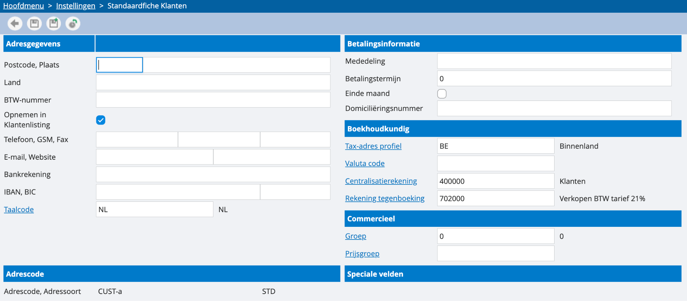

# Standaard fiches

Voor zowel klanten, leveranciers als contacten kan je via de dossierinstellingen een standaard fiche opstellen. Alle info die je hierin aanbrengt, zal automatisch als template verschijnen bij het aanmaken van een nieuwe klant. Zijn al je klanten medecontracten? Dan kan je dit in de standaardfiche aangeven, om dit niet steeds manueel te moeten aanvullen. 

