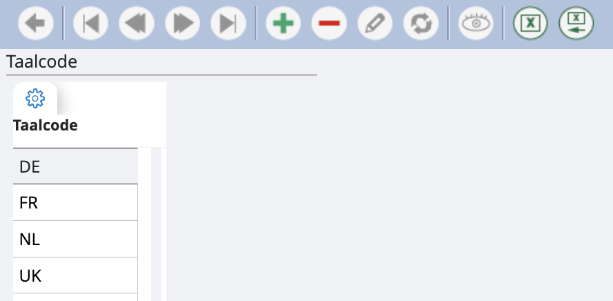

# Talen

We maken onderscheid tussen twee soorten talen:

    1. <u>*Werktaal*</u>: dit is de taal waarin het programma wordt gebruikt. Je kunt kiezen tussen Nederlands, Frans of Engels.
    2. <u>*Taalcode*</u>: dit verwijst naar de talen waarin je de output wenst. Hier ben je niet beperkt in het aantal talen. 

Via de groene plus in onderstaand scherm kun je een taalcode bijmaken. Standaard staat voor ieder dossier Frans, Nederlands, Engels en Duits ingesteld. Mocht je deze niet nodig hebben, kan je ze verwijderen. 

Als je een extra taal instelt, wordt automatisch een veld gecreëerd op de schermen waar een omschrijving wordt gevraagd. Bijvoorbeeld: je maakt taalcode ‘ESP’ voor een Spaanse output. Dan zal je bij het aanmaken van een nieuwe boekhoudkundige rekening de optie hebben om een Spaanse omschrijving te geven. Dit kan je ook afdrukken in de lijsten. 

