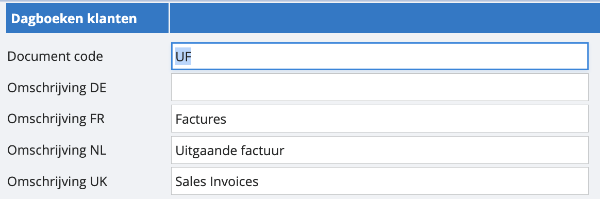
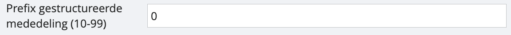

# Gestructureerde mededeling instellen

Om een gestructureerde mededeling op je uitgaande facturen te laten verschijnen, volg je deze stappen. Navigeer vanuit het hoofdmenu naar de instellingen. Open vervolgens het luik van de ‘dagboeken’ en selecteer het gewenste dagboek waarvoor je een gestructureerde mededeling wil laten verschijnen. Je krijgt onderstaand scherm:

Onderaan het scherm kun je bij ‘prefix gestructureerde mededeling' een getal invoeren bestaande uit 2 cijfers. Deze eerste 2 cijfers zullen deel uitmaken van de gestructureerde mededeling. Wanneer je een nieuwe factuur maakt, verschijnt de gestructureerde mededeling onderaan in een kader bij 'te vermelden bij betaling'.

*Tip: als je de bank automatisch boekt met CODA’s heb je een groot voordeel met de gestructureerde mededeling. Als wij bij de betaling de mededeling zien terugkomen op een openstaand document, punten we deze automatisch aan elkaar af. Meer weten over automatisch boeken van de bank en CODA?*  