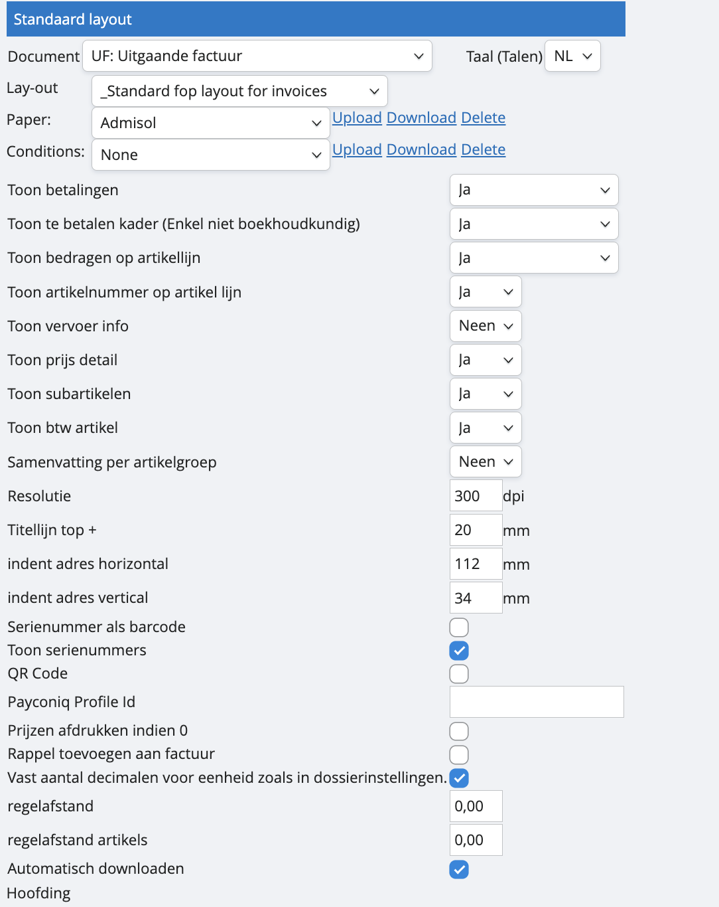

# Een eigen template

Het voordeel van werken met een eigen template voor je facturen is dat het relatief vlug is ingesteld en dat je meer vrijheid hebt om te personaliseren. Het nadeel is dat je in een extern programma het sjabloon zal moeten genereren. 

Zodra je template klaar is, navigeer je naar de ‘layout’-module, Bij ‘document’ selecteer je eerst je verkoopdagboek waarvoor je een template wil genereren, en voor welke taal. Het veld ‘lay-out’ laat je staan op de standaard zoals in dit voorbeeld hieronder.

Je zelf gecreëerde template voor je facturen en verkoopvoorwaarden laad je op onder respectievelijk ‘paper’ en ‘conditions’. Dit doe je door te klikken op ‘upload’. Vervolgens kom je terecht in een scherm waar je je bestand kan opladen en het een naam geeft.

Als je werkt met een eigen template, kunnen onze tekstvelden soms interfereren met jouw aangebracht layout. Dit kan je omzeilen door via de layout-wizard wat ruimte te creëren. 
