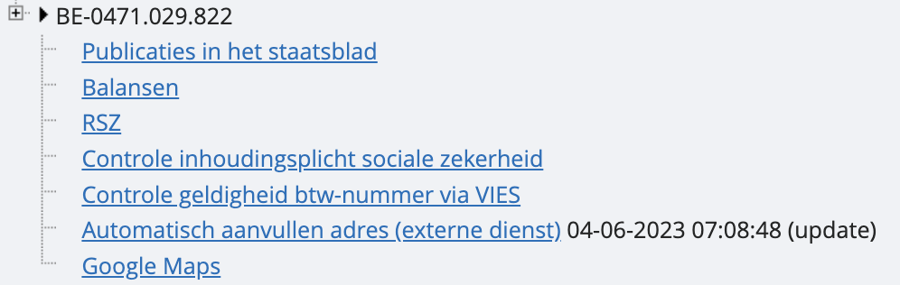
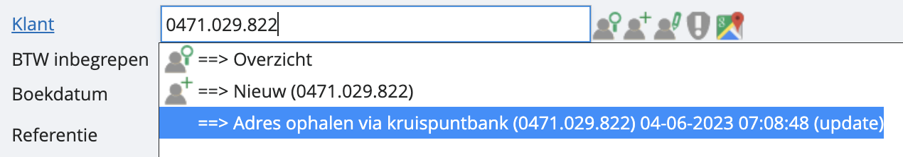

# Gegevens automatische laten aanvullen

Wij hebben een link met de kruispuntbank, waardoor adresgegevens automatisch kunnen worden ingevuld bij het aanmaken van klanten- en leveranciersfiches. Je kan op twee manieren gegevens laten invullen. 

    1. Als je al in een klanten- of leveranciersfiche zit, geef je in het veld voor het BTW-nummer het desbetreffende nummer in. Je zal zien dat er rechts een pop-up verschijnt. Hier mag je klikken op het voorlaatste lijntje ‘automatisch aanvullen’:

    

    2. Als je factuur of ander document boekt of opstelt, kan je in het identificatievak voor de klant of leverancier gewoon het BTW-nummer plakken. Hier zal je meteen de optie krijgen om het ‘adres automatisch op te halen’: 

		