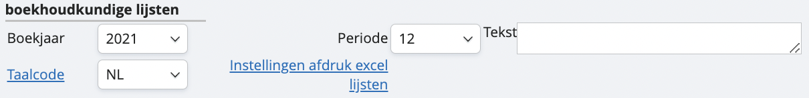
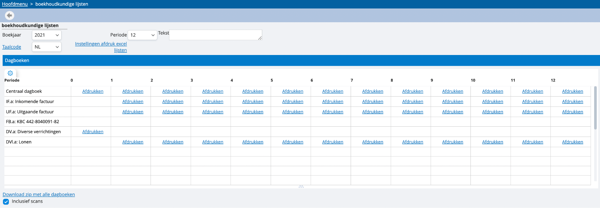
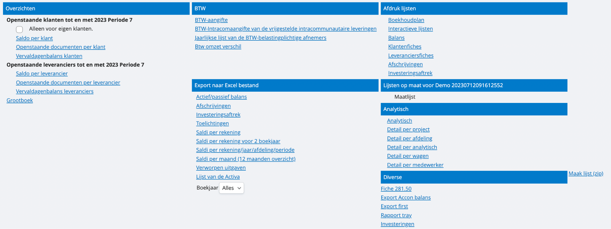

# Hoe trek ik lijsten? 

Vanuit het hoofdmenu kan je in onze tool navigeren naar ‘lijsten’, daar zal je de verschillende mogelijkheden terugvinden om lijsten te trekken.

Bovenaan kan je aangeven voor welk boekjaar en welke periode je lijsten wil trekken. Je kan ook een tekstje toevoegen dat op de afdrukken van de lijsten verschijnt, en aangeven in welke taal je de lijsten wil. 

Net daaronder heb je de mogelijkheid om je dagboeken over de verschillende periodes af te drukken. Je kan er ook voor kiezen om een zip-bestand te downloaden met al je dagboeken en eventueel zelfs inclusief de opgeladen scans, indien je het veld eronder aanklikt: 

Daaronder vind je nog verschillende andere mogelijke standaardlijsten terug. Sommige van deze lijsten zijn zowel te exporteren als XLS- als PDF-bestand. 

*Tip: wil je graag een lijst op maat van je onderneming? Die voorzien wij voor jou met plezier. Doe gerust navraag via het groene vraagteken wat de mogelijkheden zijn en wat de kostprijs hiervoor is.*

Misschien hier nog een paar belangrijke lijsten highlighten: openstaande klanten/leveranciers/actief/passief balans?