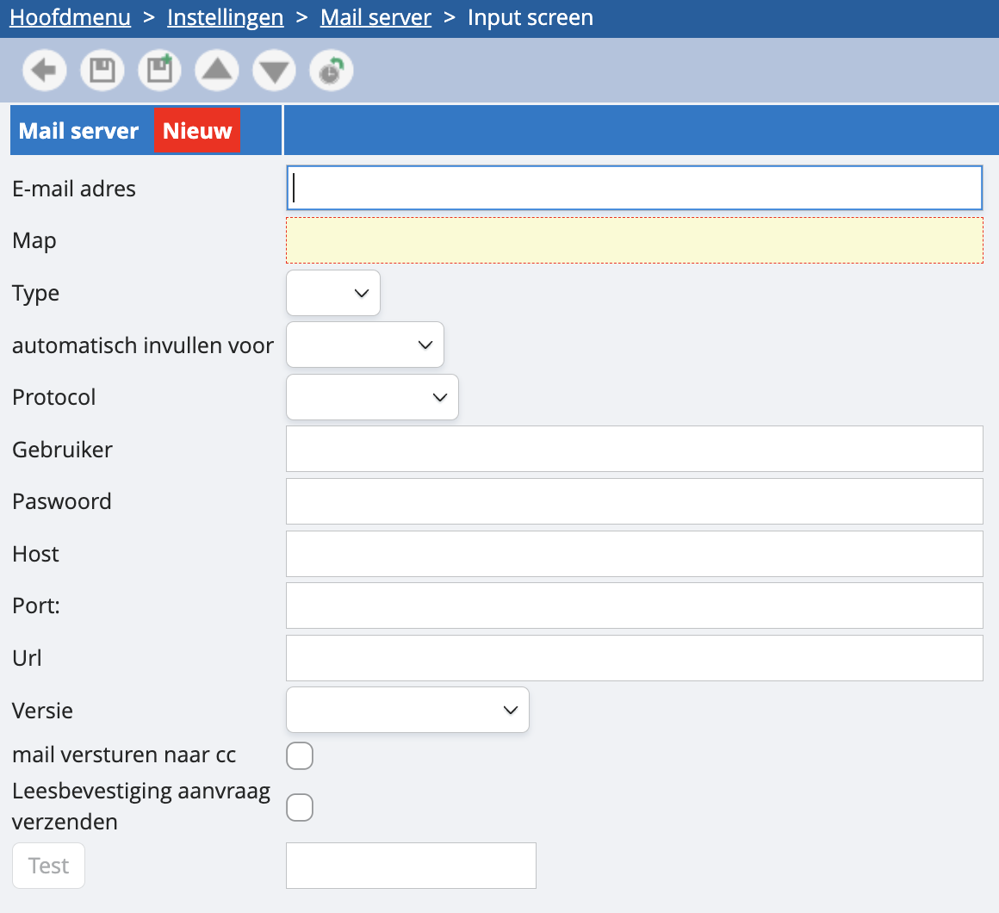

# Hoe koppel ik mijn mailserver? 

Wil je vanuit onze software mails naar je klanten sturen met hun facturen erin? Dat kan probleemloos. Vanuit een willekeurig facturatiedagboek, bijvoorbeeld dat van de uitgaande facturen, kan je via onderstaand icoontje een mail versturen naar je klant met bijlage: 

Nu, deze mail wordt niet rechtstreeks verzonden vanuit je persoonlijke mailadres, maar verloopt via [info@admisol.com](mailto:info@admisol.com). Wil je dat dit toch vertrekt vanuit je persoonlijke mailadres, stuur dan een bericht naar de helpdesk, dan activeren wij deze optie. 

Zodra dat gebeurd is, kan je je mailserver koppelen. Dit doe je door in de instellingen naar ‘communicatie’ te navigeren en vervolgens ‘mailserver’. Door op de groene plus te duwen kan je een mailserver instellen: 

<u>E-mailadres:</u>
Hier vul je het e-mailadres in van waaruit je mails wilt verzenden en waarop je de antwoorden van klanten wil ontvangen. 

<u>Map</u> 
Hier vul je “SENT” in. Dit betekent gewoon dat we louter de autoriteit hebben om mails te versturen vanuit jouw mailadres. 

<u>Type:</u>
Idem aan het veld hierboven.

<u>Automatisch invullen voor:</u>
Kies uit de dropdown uw mailing host. Je zal zien dat als je het gewenste aanduidt, de velden ‘protocol’, ‘host’ en ‘port’ automatisch worden ingevuld. Dit mag blijven staan zoals het wordt ingevuld door ons, dit heeft betrekking op de gangbare manier van instellen. 
Indien uw host er niet tussen staat dan kan u manueel de gegevens aanvullen in de velden protocol, host en poort. Vraag aan uw mailprovider wat dit dient te zijn.

<u>Gebruikersnaam</u>
Dit veld is optioneel en is in feite het mailadres waarmee er ingelogd wordt op de server. Soms is dit een ander mailadres dan hetgene waarmee gemailed wordt waarbij dit dan kan verduidelijkt worden via gebruikersnaam.

<u>Wachtwoord</u>
Dit veld is het wachtwoord waarmee er ingelogd wordt op de mailbox. Indien u met oAuth verificatie werkt (zoals bij office 365) dan is dit niet nodig. 

<u>Versie:</u>
Idem, dit is een optioneel veld. 

<u>Mail versturen in cc:</u>
Je mail zal in cc ook worden verstuurd naar het adres van waaruit je mailt. Zo heb je een verzendbevestiging en iets voor je archief. 

<u>Leesbevestiging aanvraag versturen:</u>
Laat je klanten ook goedkeuren om leesbevestigingen te sturen naar je mailbox. Let wel, wij vragen een leesbevestiging, maar dit wil niet zeggen dat er altijd een leesbevestiging zal zijn. Dit kan namelijk omzeild worden.

Nadat u bewaard hebt raden wij de mailinstellingen nog eens te openen en te drukken op “test”. Admisol gaat dan een mail versturen naar uw eigen mailadres. Indien dit lukt zal u hiervan melding krijgen. Indien niet krijgt u een foutmelding. 

Om de mailserver nu te linken kan dit op twee manieren:

1. **Aan een gebruiker.**
Ga hiervoor naar Instellingen - Dossierinstellingen - Gebruikers. Open de gebruiker en kies bij email verzender de mailserver waaruit de mails verstuurd dienen te worden.

2. **Aan een dagboek.**
Ga hiervoor naar Instellingen - Dagboeken - Klanten/Leveranciers en kies een facturatiedagboek. Hier zal u ook het veld mailserver zien waar u de juiste server kan kiezen. 
