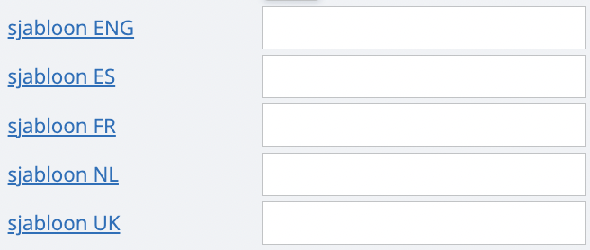

# Mailtemplate instellen

Stel, je hebt enkele mailtemplates gemaakt, bijvoorbeeld eentje voor het versturen van je gewone facturen, eentje voor het versturen van je creditnota’s. Wil je deze templates nu graag koppelen aan een dagboek in onze tool, zodat automatisch de juiste verschijnt? 

Dat kan. Via ‘instellingen’, ‘dagboeken’ kan je voor iedere actieve taal in je dossier een vaste mail template kiezen. De taal die zal verschijnen is afhankelijk van de klant naar wie je stuurt. 

