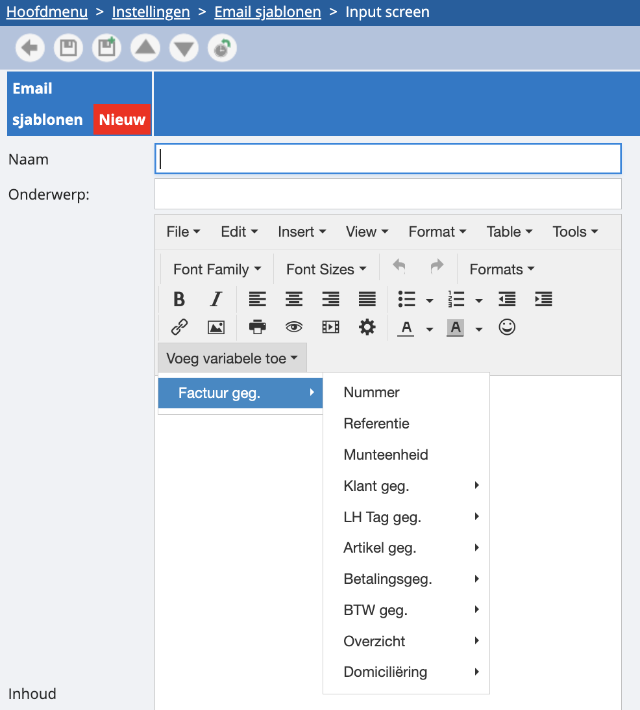

# Mailtemplate maken

Wil je graag vaste sjablonen voor het uitsturen van je mails in onze tool? Dat kan. Dit moet je echter wel expliciet laten activeren via het groene vraagteken rechtsboven in de tool. Als dit gebeurd is, kan je de sjablonen instellen via ‘instellingen’, ‘communicatie’ en ‘email sjablonen’. Een nieuwe toevoegen doe je door op de groene plus te klikken. 

Hier kan je een naam aan je sjabloon meegeven, zodat je het snel terugvindt bij het opstellen van je mails. Je kan ook een onderwerp en een inhoud meegeven. 

*Tip: bij ‘inhoud’ kan het interessant zijn om aan je vaste tekst ook enkele variabelen mee te geven. Je kan met onze functie voor variabelen bijvoorbeeld eenvoudig een tekstje opstellen als: ‘beste klant, dit is je factuurnummer x voor een bedrag van x, gelieve te betalen tegen datum x.’*

*Om dit in te stellen zal u bij de eerste variabele echter het document dat onderaan vermeld staat in het voorbeeld dienen te vermelden in de variabele. Bijvoorbeeld als in het voorbeeld UF.a.2023.1 staat zal u bij de eerste variabele (bijvoorbeeld reference)  #doc(UF.a.2023.1).(reference) dienen te zetten. Bij andere variabelen hoeft dit niet.*

U kan ook afbeeldingen toevoegen aan de mailtemplate. Ofwel gaat bij Insert Insert/Edit image de url ingeven van een afbeelding dat ergens al gehost staat of u kan via Instellingen -Communicatie - Afbeeldingen een afbeelding uploaden en die een naam geven. Dan volstaat het om bij source #mailimage() in te vullen met tussen haakjes de naam bijvoorbeeld #mailimage(logo).

