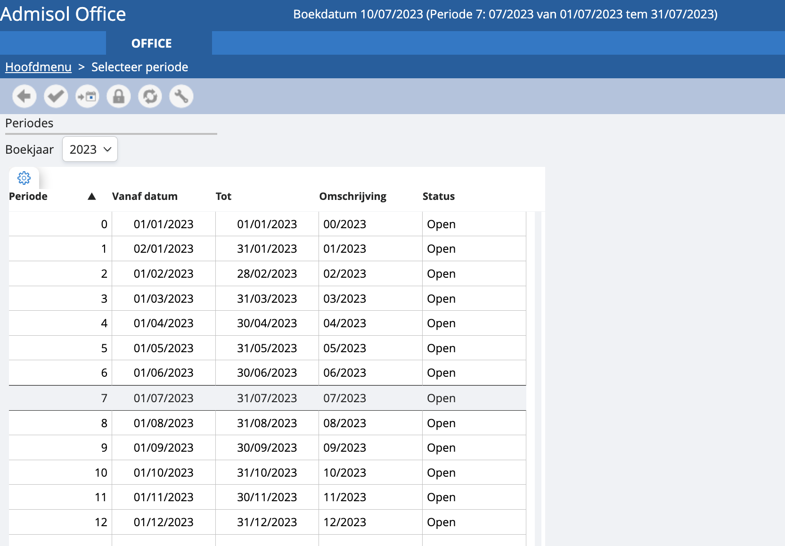

# Keuze periode

Vanuit vrijwel ieder scherm waarin je iets kan uitvoeren dat betrekking heeft op de boekhouding, heb je de mogelijkheid om rechtstreeks je periode te selecteren via dit icoon.   

Bovenaan links kun je het boekjaar selecteren. In de tabel daaronder selecteer je de bijbehorende periode.

 Hiermee selecteer je de huidige periode, waarbij de boekdatum automatisch wordt aangepast naar de datum van vandaag.

 Met deze toets sluit je alle periodes tot en met de geselecteerde periode definitief af. Iemand die geen accountant is kan de periodes niet afsluiten. Je kan dit dan enkel door een bericht te sturen naar onze helpdesk. Accountants kunnen dit wel, maar om vergissingen te vermijden zullen we een extra bevestiging vragen via een sms-code.

*Let op: eenmaal een periode is afgesloten, kunnen boekingen in die periode niet meer worden gewijzigd. Een afgesloten periode kan op geen enkele manier worden heropend.*

 Instellingen: hiermee kun je boekjaren en boekhoudkundige periodes aanmaken. Meer info over de aanmaak van nieuwe periodes?

*Tip: indien je per ongeluk een reeks facturen in de verkeerde periode hebt geboekt, kan je dit veelal snel verhelpen via de hulpprogramma’s. Meer weten?*