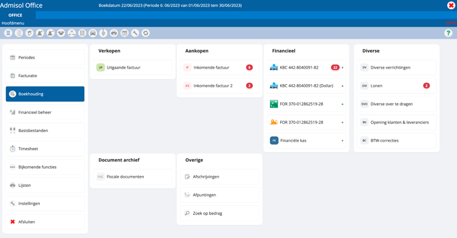
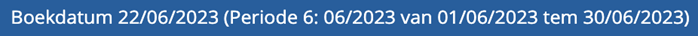
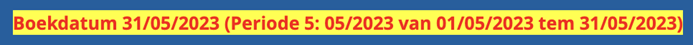

# Het startscherm

Hieronder zien jullie een voorbeeld van een mogelijk startscherm. Laten we dit onderdeel
per onderdeel overlopen:

## Periode

Helemaal boven aan ons scherm vinden we de boekdatum terug, met de daarbij horende periode waarin we werken. Bij het opstarten van de tool nemen we altijd de huidige datum als boekdatum. Indien er voor de huidige datum nog geen periode bestaat, nemen we de recentste. 

Let op: als je beslist om over te schakelen naar een andere periode dan de huidige, dan zal deze balk opvallender worden weergegeven, zoals in het voorbeeld: 

Bovendien zal je dan tijdens het boeken nu de melding krijgen dat je in een andere periode dan de huidige werkt, dit om fouten door onoplettendheid te vermijden. Desondanks kan je probleemloos opslaan en verder boeken. 

## Sneltoetsen

In de balk hieronder vinden we een hele reeks sneltoetsen, die kunnen aangroeien naargelang de noden en wensen van uw onderneming: 

We overlopen de functie van deze sneltoetsen:

 Rekeningstelsel

 Projecten (analytisch boeken)

 Klanten

 Leveranciersoverzicht

 Artikelen

 Afdelingen (analytisch boeken)

 Analytisch (analytisch boeken)

 Wagens (analytisch boeken)

 Medewerkers (analytisch boeken)

 Lijsten

 Periodes: schakelen tussen periodes

 Instellingen

 Refresh

## Menubalk

In dit overzicht wordt bijgehouden hoe je navigeert, met andere woorden op welke manier je bent gekomen op de plek waar je bent in de tool. Bovendien kan je eenvoudig terug navigeren door op de vorige stappen te klikken. 

    In bovenstaand voorbeeld ben je aanbeland bij de BTW-aangifte. Je kan eenvoudig terugkeren naar de lijsten en het hoofdmenu door op de onderstreepte woorden te klikken. 

Opmerking: terugkeren naar een vorige fase kan altijd door links boven aan op de pijltjestoets te drukken of de toetsencombinatie Alt+B te gebruiken. 

