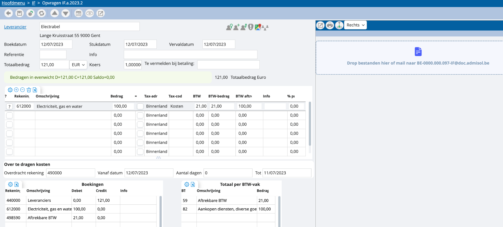

# Hoe koppel ik een scan aan een geboekte factuur? 

Heb je een document geboekt, maar wil je hier achteraf nog de scan van je factuur uploaden voor je online archief? Dat kan! Je opent de desbetreffende boeking, en rechts zal je de mogelijkheden terugvinden om te uploaden: 

    1. Werk via drag and drop
    2. Zoek rechtstreeks in je bestanden met onderstaande toets: 
	