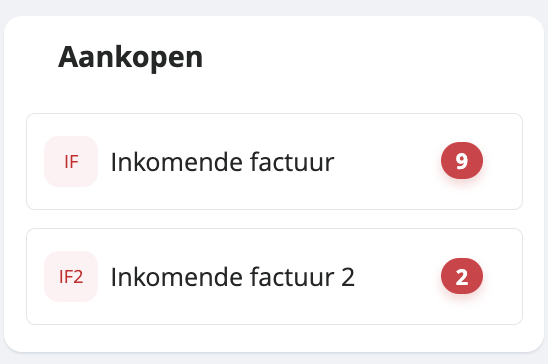
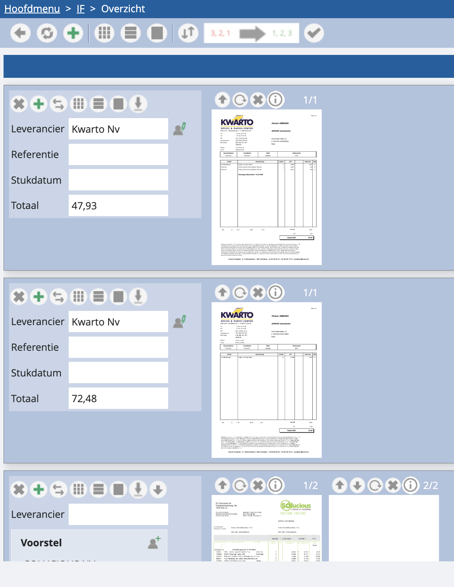
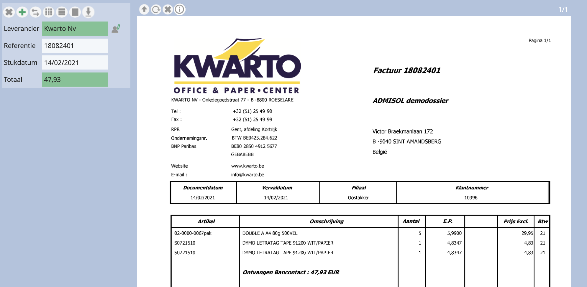
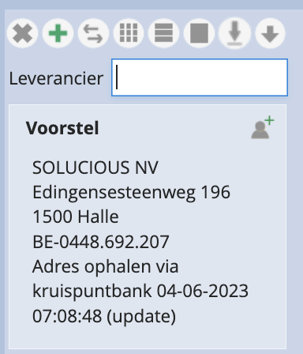

# Hoe verwerk ik gescande facturen? 

Heb je je facturen nu opgeladen in onze tool? Dan zal je zien dat er in het hoofdmenu bij het dagboek een cijfer in het rood is bijgekomen. Dit cijfer slaat op het aantal pagina’s dat je hebt opgeladen en die nog niet verwerkt zijn: 

Wil je deze 9 opgeladen pagina’s nu beginnen verwerken, dan doe je dit door het dagboek te openen en bovenaan in het overzicht op de groene plus te klikken. Vervolgens kom je in een overzicht met alle opgeladen bestanden. 

*Let op: in nieuwe dossiers opent er veelal een pop-up van een filmpje met tekst en uitleg over hoe je scans kan verwerken. Bekijk dit als hulpmiddel. In de toekomst kan je de video via dit scherm nog raadplegen via het groene vraagteken rechtsboven. *

In deze fase raden we aan om in het overzicht van bestanden steeds eerst over te schakelen op de miniatuurweergave via onderstaande toets. Vervolgens zal je een globaal overzicht zien van alle pagina’s die ‘samen’ een factuur vormen: 

*Tip: het is niet nodig om per factuur een apart bestand op te laden. Alle facturen mogen in één groot bestand zitten. Wij zullen dankzij onze factuurherkenning (OCR) de bestanden automatisch splitsen op basis van het teruggevonden BTW-nummer op de afzonderlijke facturen.*

Mocht de uitsplitsing niet correct gebeurd zijn, of mochten er onnodige pagina’s in het overzicht zijn terechtgekomen, dan is dit het uitgelezen moment om pagina’s te verwijderen of van plaats te veranderen. Meer weten over hoe je scans verwijdert en verplaatst? 

Als je deze stap hebt gedaan, kun je via onderstaand icoontje terugschakelen op de volledige weergave van de facturen: 

Nu kan je al wat relevante informatie aan je te verwerken facturen meegeven: de leverancier, de referentie, de stukdatum en het totaalbedrag: 

## Leverancier

Dankzij onze OCR zal er in vele gevallen een BTW-nummer van de leverancier worden herkend. Indien dit BTW-nummer overeenkomt met een leverancier die reeds in je dossier zit, dan zal de leverancier meteen worden voorgesteld zoals in het voorbeeld hierboven. 

*Let op: indien we een BTW-nummer terugvinden, maar geen match vinden met een leveranciersfiche in je dossier, zullen we op basis van dit BTW-nummer voorstellen om een leveranciersfiche aan te maken. We putten hierbij uit zowel informatie op de factuur, als informatie uit de kruispuntbank. Je klikt op het voorstel, bouwt de leveranciersfiche op zoals je wil, en bewaart. Dit voorstel ziet er zo uit:*

	

## Referentie

De eerste keer dat je een factuur van een leverancier behandelt, zal de referentie niet automatisch worden ingevuld. Wil je de referentie rechtstreeks van de factuur overnemen, dan doe je dit door op de juiste plek in de factuur te klikken. Hier toon je onze tool waar we welke informatie kunnen terugvinden, zodat we dit in de toekomst automatisch kunnen aanvullen. 

*Let wel: indien het om een gesplitste referentie gaat, bijvoorbeeld met een spatie of andere ruimte ertussen, dan zal je het geheel van de referentie moeten selecteren. Klikken gaat dan niet. *

## Stukdatum

Hierbij geldt hetzelfde als voor de referentie. Je klikt op de juiste plek, indien het een gesplitste datum betreft, selecteer je. De tool onthoudt je vorige selectie voor de volgende facturen van deze leveranciers. 

## Totaal

Indien onze tool niet meteen een voorstel of het verkeerde heeft gedaan voor het totaalbedrag, dan klik of selecteer je het juist bedrag

*Om de scan na deze fase in te boeken, druk je op het kleine groen plusje naast de desbetreffende factuur. Meer weten over hoe je boekt?*