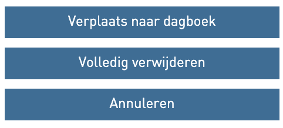
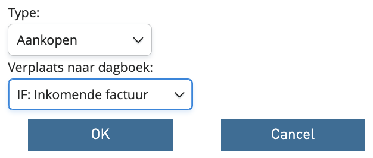
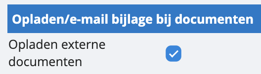

# Hoe verwijder en verplaats ik scans? 

n het overzicht met opgeladen scans, vinden we enkele interessante toetsen terug die ons zullen helpen om facturen te verplaatsen binnen een dagboek, naar een ander dagboek of volledig te verwijderen. Al deze toetsen vind je terug op factuur- en paginaniveau: 

 Met deze toetsen kun je een document of een reeks documenten verplaatsen binnen het dagboek waarin je zit. Dit is handig om facturen uit te splitsen. 

 Wil je een scan roteren? Dat kan met deze toets. 

 Een scan verwijderen of verplaatsen naar een ander dagboek doe je met deze toets. Je krijgt volgend keuzemenu als je erop klikt: 

Indien je voor de eerste optie kiest, verplaatsen, moet je in de volgende stap naar specifiëren naar waar en bevestigen: 

Let op: zorg er wel altijd voor dat het dagboek waarnaar je wil verplaatsen externe documenten kan ontvangen. Dit activeer je via de instellingen, dagboeken:

