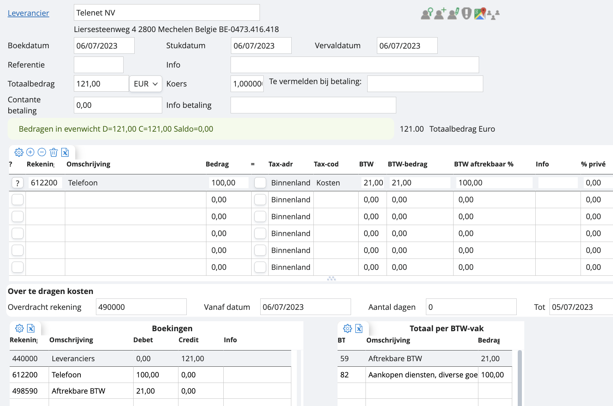

# Telenet met enkel telefoon

Hoe beginnen we hieraan? Je gaat naar je dagboek van inkomende facturen, drukt op de groene plus. In principe moeten er in je blanco boeking maar twee velden worden ingevuld vooraleer wij een boekvoorstel kunnen genereren:

    1. De leverancier: indien de leveranciersfiche al bestaat, tikken we gewoon een deel van zijn naam en kiezen de juiste optie. Indien de leverancier nog niet gemaakt is in je dossier, kan je die van hieruit rechtstreeks aanmaken door op het ‘mannetje met het plusje’ te klikken. Belangrijk is om het boekhoudkundig luik hier goed aan te vullen! Meer info over het aanmaken van leveranciers? 
    2. Het totaalbedrag. Hier vul je het te betalen bedrag in, inclusief BTW. 

Je zal zien dat zodra je dit hebt ingevuld, onze software automatisch een boekvoorstel genereert, gebaseerd op de info die we terugvinden in je leveranciersfiche. Onderaan vinden we links alle gebruikte rekeningen terug, en rechts de BTW-vakken. 

Zodra je tevreden bent, sla je op met het diskette-icoontje. 