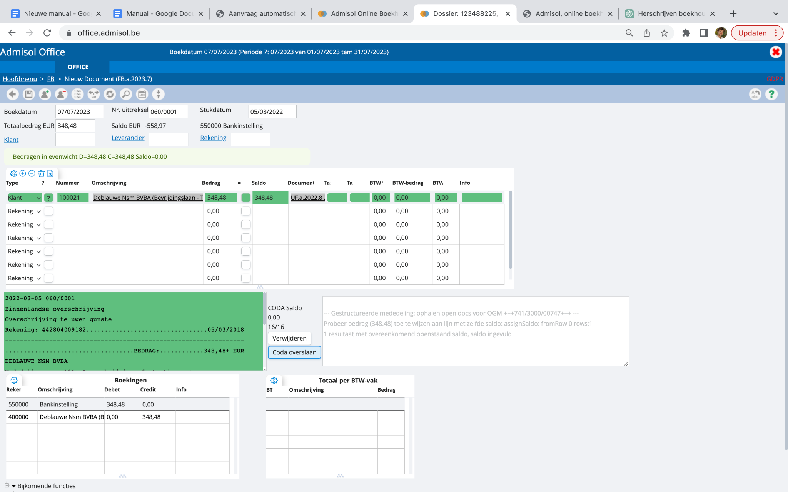

# Gestructureerde mededeling

Wanneer er bij een verrichting een gestructureerde mededeling wordt herkend die ook terugkeert in een openstaand document in je dossier, dan zullen wij deze twee automatisch aan elkaar afpunten. Dat zie je gebeuren in het groen: 

