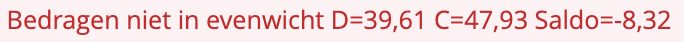
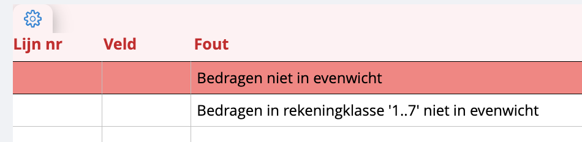
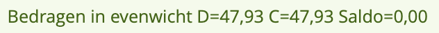

# Basisprincipes

We onderscheiden vier dagboeken: 

>a. **Verkopen**: hier kun je uitgaande facturen en creditnota's bijhouden.
>
>b. **Aankopen**: dit is voor inkomende facturen en creditnota's.
>
>c. **Financieel**: dit dagboek is voor je bank- en kasboek.
>
>d. **Diverse**: dit dagboek bevat diverse algemene rekeningen, het openingsdagboek voor klanten en leveranciers, en het BTW-correctiedagboek.

Je kunt ook zelf extra dagboeken toevoegen naar wens, bijvoorbeeld een apart financieel dagboek voor elke bankrekening. <u>Meer info over het instellen van je financieel dagboek?</u> 

## Periode open of afgesloten

Zolang de periode niet afgesloten is, kunnen boekingen nog aangepast worden. De lijsten die je afdrukt voor niet-afgesloten periodes zullen gemarkeerd zijn als ‘voorlopig’.

*Let op: zodra een periode is afgesloten, kunnen er GEEN wijzigingen meer worden aangebracht in de boekingen. Aanpassingen kunnen dan alleen nog worden gedaan via tegenboekingen.*

## Chronologische volgorde

De nummering van documenten moet chronologisch de periodes volgen. Een document met nummer 100, geboekt in periode 3, kan bijvoorbeeld nooit gevolgd worden door document 101 geboekt in periode 2. Als er al een document is geboekt in een periode, kan er nooit een document van hetzelfde dagboek worden geboekt in de voorgaande periode. Er is wel een hulpprogramma beschikbaar waarmee je documenten kunt verplaatsen naar een andere periode. Meer weten over de hulpprogramma’s? 

## Document verwijderen

De nummering van een dagboek moet altijd doorlopend zijn; er mogen geen nummers ontbreken. Daarom kan alleen het laatste document worden verwijderd, en alleen als dit document zich in een open periode bevindt.

## Boekhoudkundig evenwicht

Je kunt alleen boekingen maken waarbij debet en credit gelijk zijn. Als er een onevenwicht is, krijg je daar een melding van: 

Bedragen die wel in evenwicht zijn, krijgen de volgende melding: 

