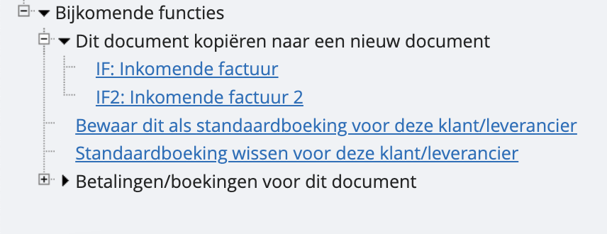

# Boekingen dupliceren

Als je een regelmatig terugkerende factuur hebt, kan het handig zijn om een vorig document te kopiëren of dupliceren naar een nieuw document. Volg deze stappen:

Ga naar het correcte dagboek en open het desbetreffende document. Onderaan vind je nu de mogelijkheid om het document in een dagboek naar keuze te dupliceren (in dit geval de twee aankoopdagboeken). Zodra je het juiste dagboek aanklikt, wordt het document gedupliceerd, waarna je eventuele aanpassingen kan doen. 