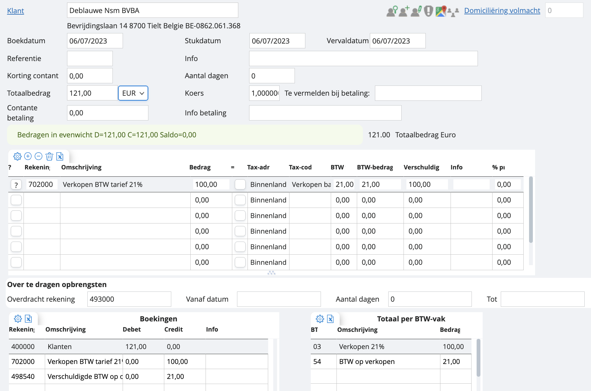

# Verkoopfacturen boeken: voorbeeld

Wat het boeken van de verkopen betreft, heb je in onze software meerdere opties: 

    1. Indien je je verkoopfacturen aan klanten artikelkundig opstelt in onze software, komen ze automatisch in je boekhoudkundig verkoopdagboek terecht. Meer weten over hoe je factureert? 
    2. Indien je je facturen opstelt in een extern programma, kan je deze in onze software importeren en op basis van de scans je boeking doen. Meer weten over hoe je scans oplaadt? 
    3. Net zoals bij de aankopen, kan je in je verkoopdagboek beginnen vanuit een blanco boekingsscherm. Hieronder zie je hoe je dit doet: 

Je navigeert naar je verkoopdagboek, drukt op de ‘groene plus’. Daarna vul je het veld van de klant in, een totaalbedrag, en wij genereren een boekvoorstel op basis van de gegevens die we terugvinden in de klantenfiche (tax-adres profiel en tegenrekening).

Wil je nu factureren aan een medecontractant, zonder BTW, binnen de EU, aan verschillende BTW-tarieven, etc? Dan speel je net zoals bij de aankoopfacturen met de parameters in het raster. Je kan hier gerust extra rekeningen toevoegen, tax-code en tax-adres profiel wijzigen, BTW-percentage bijwerken, etc… 

*Let op: met deze stappen maak je geen verkoopfactuur in PDF. Om dit te doen zal je gebruik moeten maken van de functie ‘facturatie’. Meer weten over facturatie?*