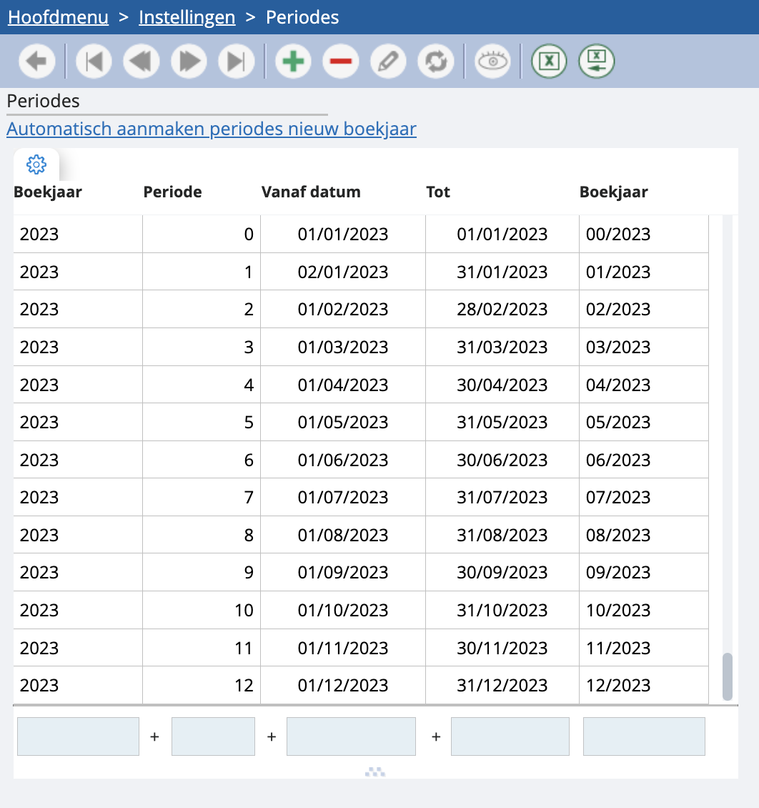
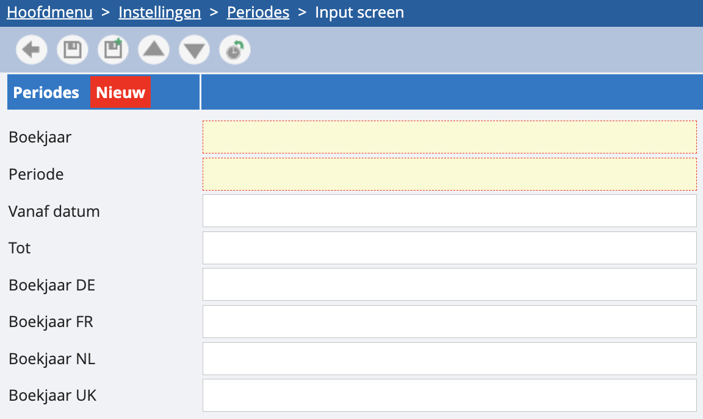

# Periodes

Periodes zijn essentieel binnen accountancy software. Volgens de richtlijnen van het IAB hebben alle documenten zowel een boekdatum als een stukdatum. De stukdatum is vrij, maar de boekdatum moet altijd binnen een afgebakende periode vallen.

Via dit onderdeel kun je nieuwe boekjaren en periodes aanmaken. Dit doe je door op de groene plus te klikken. 

## Boekjaar
Een boekjaar hoeft niet gelijk te lopen met een kalenderjaar. Het kan beginnen op 1 januari of op 17 september. Een boekjaar kan ook langer of korter zijn dan een kalenderjaar. 

## Periode
Het boekjaar is onderverdeeld in verschillende periodes. We beginnen met periode 0, de openingsperiode. Deze periode beperkt zich tot de eerste dag van het boekjaar.

*Voor BTW-handelingen gebruiken we geen periodes. BTW-handelingen lopen altijd over een kalenderjaar (de listing), of maand en kwartaal (de aangiftes).*

## Vanaf datum ... tot ...
Via deze velden geef je de looptijd aan waarin de boekdata voor deze periode moeten vallen.

## Boekjaar DE / FR / NL / UK
Hier vul je de beschrijving in voor elke geactiveerde taal.

*Let op:*

*Elk boekjaar heeft een periode 0 nodig voor de eerste dag van het boekjaar. Maak deze periode dus zeker aan.*

*Maak automatisch de periodes voor het volgende jaar aan via de link ‘automatisch aanmaken periodes nieuw boekjaar’. Nadat je de periodes hebt aangemaakt, moet je eerst naar het hoofdmenu gaan en vervolgens terug naar 'periodes' om de nieuwe periodes te zien.*