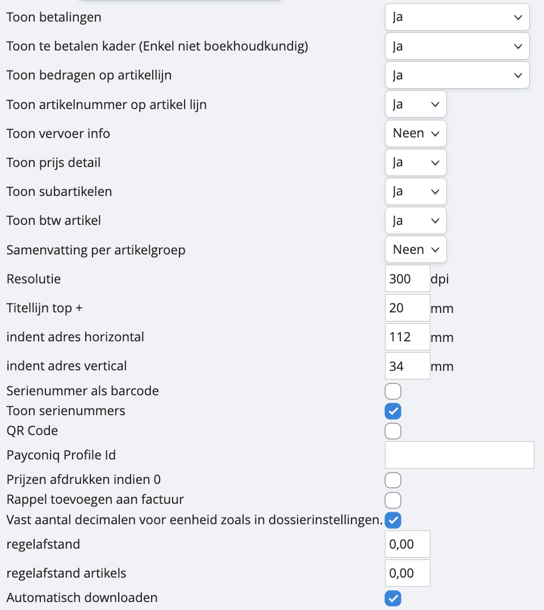
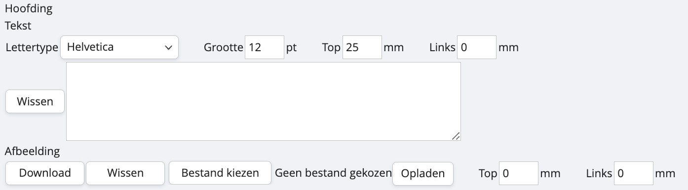
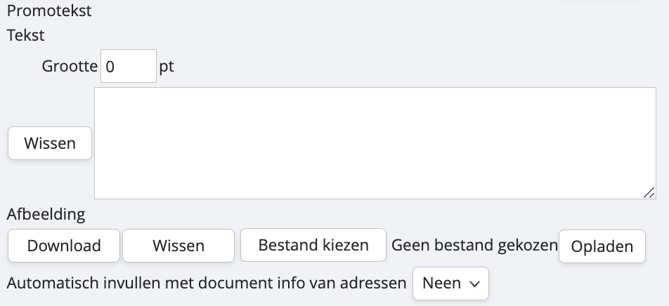
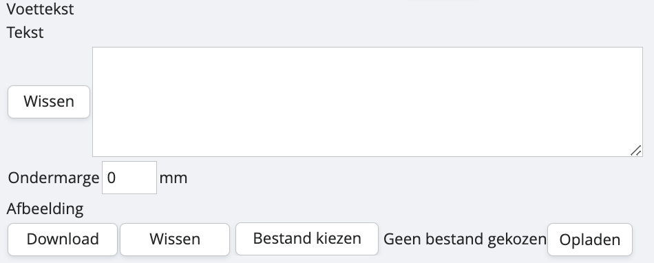
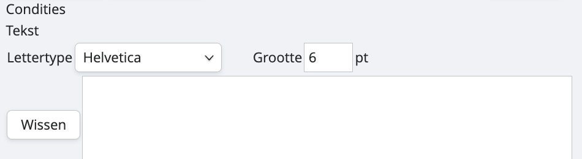
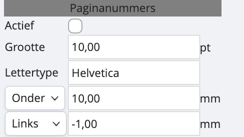
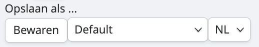

# Met de layout-wizard

Het voordeel van onze layout-wizard is dat we je begeleiden om je layout in te stellen via onze software. Het nadeel is dat je minder vrijheid hebt om de factuur aan te passen naar je persoonlijke ‘look and feel’. 

Hoe ga je tewerk in onze layout-wizard? We overlopen de verschillende onderdelen:  

<u>Toon betalingen</u>
Wil je een melding tonen als een factuur (gedeeltelijk) werd betaald? 

<u>Toon te betalen kader</u>
Wil je het ‘te betalen’-kader tonen als er een te betalen saldo is?

<u>Toon bedragen op artikellijn</u>
Wil je de eenheidsprijs en de totaalprijs op je PDF tonen? 

<u>Toon artikelnummers op artikellijn </u>
Wil je artikelnummers weergeven op je factuur? 

<u>Toon vervoer info</u>
Intrastat-info meesturen of niet? 

<u>Toon prijs detail</u>
Hiermee kan je kiezen of je zowel de aantal als de prijzen van je afzonderlijke artikelen wel of niet toont. Indien dit niet actief staat zal er geen aantal of eenheidsprijs getoond worden, enkel een totaalprijs.

<u>Toon BTW-artikelen</u>
Louter de totale prijs weergeven of zowel de BTW-percentages als de nettoprijzen? 

<u>Toon subartikelen</u>
Enkel van toepassing indien je met samengestelde artikelen werkt, dan zal het detail, de samenstelling wel of niet achterwege worden gelaten.

<u>Samenvatting per artikelgroep</u>
Artikelen kan je onderbrengen in artikelgroepen, deze onderverdeling kan je ook laten verschijnen op je facturen. 

<u>Resolutie</u>
Dit is de resolutie van het opgeladen logo. Wij raden aan dit op 300dpi te zetten. Je kan dit verhogen of verlagen om een opgeladen logo groter of kleiner te tonen. 

<u>Titellijn top +</u>
Hiermee kun je het detail van je factuur, het deel onder de adresgegevens, naar beneden verplaatsen door een aantal millimeters in te stellen.

<u>Indent adres horizontal, vertical</u>
Hiermee kan je de plek van je adres wijzigen.

<u>Serienummers als barcode</u>
Indien je werkt met serienummers kan je deze als barcode laten verschijnen op je factuur. 

<u>Serienummers tonen</u> 
Naast een barcode kan ze ook als numerieke code laten verschijnen. 

<u>QR-code </u>
Wil je een QR-code op je facturen laten verschijnen zodat klanten meteen op betaling kunnen overgaan? 

<u>Payconiq Profile ID</u>
Wil je een QR-code van Payconiq laten verschijnen op je factuur? Vul dan hier je ID in. Meer weten over hoe je de koppeling met Payconiq tot stand brengt? 

<u>Prijzen afdrukken indien 0</u>
Nulprijzen afdrukken kan handig zijn als je wil tonen dat je iets gratis geeft. 

<u>Rappel toevoegen aan factuur</u>
Bij afdruk van je facturen ook de rappel-info meegeven of niet? 

<u>Vast aantal decimalen </u>
Indien je bijvoorbeeld eens 1,5 stuks hebt, dan weer 1,67; dan kan dit telkens naar twee decimalen worden gebracht voor de overzichtelijkheid

<u>Regelafstand</u>
Tussen artikelen en algemeen in te stellen.

<u>Automatisch downloaden</u>
Zodra je een factuur opslaat, zal deze automatisch worden gedownload. Als je dit afzet, kan je via het printertje altijd nog de pdf genereren.

In de hoofding kan je bij tekst de gegevens van je onderneming meegeven. Je kan hier het lettertype, grootte en positie van je adresgegevens zetten. Eventueel kan je onder afbeelding ook een logo uploaden. 

Je kan in deze velden gebruikmaken van de gegevens uit je bedrijfsidentificatie.  Dit door in plaats van de gegevens zelf in te vullen gebruik te maken van variabelen:

#comp_ad_name: Naam dossier.
#comp_ad_street: Straat Dossier
#comp_ad_number: Nummer dossier.
#comp_ad_box: Bus dossier.
#comp_ad_zip #comp_ad_city: Plaats dossier
#comp_ad_vat: BTW nummer dossier. 

Bij de promotekst kan je eventueel je jaarlijkse vakantie meegeven aan klanten, een slogan die je hebt ontworpen, de aankondiging van een nieuw product of dienst… ook hier is er de mogelijkheid om een afbeelding op te laden. 

Met de functies onderaan ‘automatisch laten invullen met document info van adressen’ kan je de tekst die je bij het factureren ingeeft automatisch op deze plek laten verschijnen. 

De voettekst is het veld onderaan de pagina, eventueel kan je in de plaats van in de hoofding hier je adresgegevens laten verschijnen, en bovenaan louter het logo. Dat kies je volledig zelf. 

In dit tekstveld kan je je verkoopsvoorwaarden meegeven. 

Indien je lange facturen opstelt, kunnen paginanummers interessant zijn. Hier kan je instellen of ze er staan en hoe ze er dan uitzien. 

Met deze handige  functie kun je eenvoudig een template dupliceren naar een ander dagboek of een andere taal.