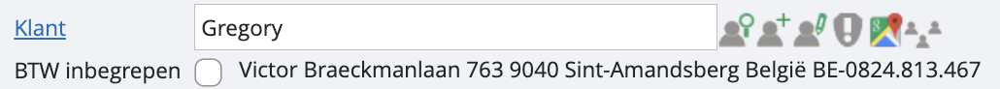

# Verkoopfactuur maken

Om een nieuwe factuur op te stellen, navigeren we vanuit het hoofdmenu in het menu links naar ‘facturatie’ en vervolgens rechts naar ‘uitgaande factuur’. Nu verschijnt er alweer een raster met alle verkoopfacturen die je in het verleden hebt opgesteld. Hier heb je zoals in andere rasters de mogelijkheid om te filteren, sorteren, exporteren etc… 

Hier zien we twee nieuwe icoontjes in het lint bovenaan: 

Met het linkse kan je de geselecteerde factuur in het raster downloaden. Met het rechtse kun je de geselecteerde factuur verzenden naar je klant. <u>Meer weten over hoe je je mailserver koppelt en mailtemplate maakt, zodat je facturen kan verzenden naar je klanten?</u>
Wil je nu een nieuwe factuur maken, dan klik je bovenaan in het lint op de groene plus. Een leeg facturatiescherm zal verschijnen. Daarin kunnen we bijvoorbeeld de volgende gegevens invullen: 

We overlopen de verschillende onderdelen van het scherm: 

Bij ‘klant’ zoeken we de desbetreffende klant. Indien er nog geen klantenfiche is, kan die eenvoudig van hieruit aanmaken. Je kan daarvoor klikken op het mannetje met de plus naast dit veld, of de naam van je nieuwe klant typen en klikken op ‘nieuw’. 

*Tip: indien je B2B factureert, kan je het BTW-nummer van je klant invullen, dan zullen we de klantenfiche automatisch aanvullen met de info die we vinden in het KBO.*

<u>Boek-, stuk- en vervaldatum</u>
De boekdatum is automatisch de huidige datum. Stukdatum kan hiervoor verschillen. De vervaldatum is de datum waartegen de klant zijn of haar factuur moet betalen.

<u>Referentie</u>
Optioneel om iets te verduidelijken aan je klant

<u>Totaalbedrag</u>
Het totaalbedrag van de factuur. Dit wordt automatisch berekend op basis van de gegevens in het raster onderaan.

<u>Korting contant en aantal dagen </u>
Indien je klanten genieten van een korting indien ze binnen de x-aantal dagen betalen, kun je dat in dit veld aangeven. Dit verschijnt ook op je factuur. 

<u>Contante betaling met extra info</u>
Indien de klant reeds een cash-betaling heeft gedaan, eventueel zelfs maar een deel van het totale bedrag, dan kan je dit hier ook ingeven. Dit zal, samen met de extra info, op de factuur van je klant verschijnen. Hou er rekening mee dat dit ook een extra kasboeking genereert in het gelinkte kasboek.

Vervolgens vul je het detail van je factuur in. Hier kan je op twee manieren te werk gaan: 

    1. Je vult zoals op het eerste lijntje alles manueel in: het aantal artikelen, de omschrijving van je artikel, de prijs… 
    2. Je kan ook werken op basis van vaste artikelen in onze software, zoals op de tweede lijn. Hier kan je alvast wat informatie meegeven die automatisch in het grid zal verschijnen. Wil je meer weten over artikelen aanmaken? 

<u>Artikelnummer</u>
Heb je een artikel opgeslagen dat je wil gebruiken? Dan vul je in dit veld een deel van het artikelnummer of de naam in, en selecteer je het juiste. Indien je niet op basis van een artikel wil werken, laat je dit leeg. 

<u>Aantal</u>
Het aantal stuks. Gebruik een negatief getal als je een creditnota wilt aanmaken.

<u>Omschrijving</u>
De omschrijving van het artikel wordt al ingevuld, maar je kunt dit nog aanpassen.

<u>Prijs</u>
De prijs van het artikel wordt automatisch ingevuld vanuit de artikelfiche, maar je kan dit aanpassen.

<u>Korting</u>
Een positief bedrag, bijvoorbeeld "10", staat voor een korting van -10%. Dit heeft betrekking op de nettowaarde van je artikel, terwijl de ‘korting contant’ bovenaan betrekking heeft op het geheel van je nettowaarde en BTW. 

<u>Totaal</u>
Het totaalbedrag van de regel. Dit wordt automatisch berekend. Als je dit rechtstreeks aanpast, zal ook het aantal stuks automatisch mee veranderen. Je kan altijd via de helpdesk vragen om in plaats hiervan de eenheidsprijs te veranderen.

<u>Tax-adres profiel</u>
Dit wordt overgenomen van de klantenfiche, maar je kunt het handmatig aanpassen, bijvoorbeeld voor medecontractant.

<u>Tax-code</u>
Dit is het type boeking en wordt al ingevuld op basis van de artikelfiche, maar je kunt het hier aanpassen.

<u>BTW %</u>
Het BTW-percentage wordt al ingevuld op basis van de tax-relaties.

<u>Rekening</u>
Deze wordt automatisch ingevuld op basis van de artikelfiche, maar kan opnieuw worden aangepast.

Onderaan worden je totalen, zowel netto als BTW, bijgehouden. Zodra je tevreden bent over je opgestelde factuur, klik je op opslaan via het diskette-icoontje. Vervolgens zal je zien dat er een pdf-bestand wordt gegenereerd met de factuur in je persoonlijke layout.