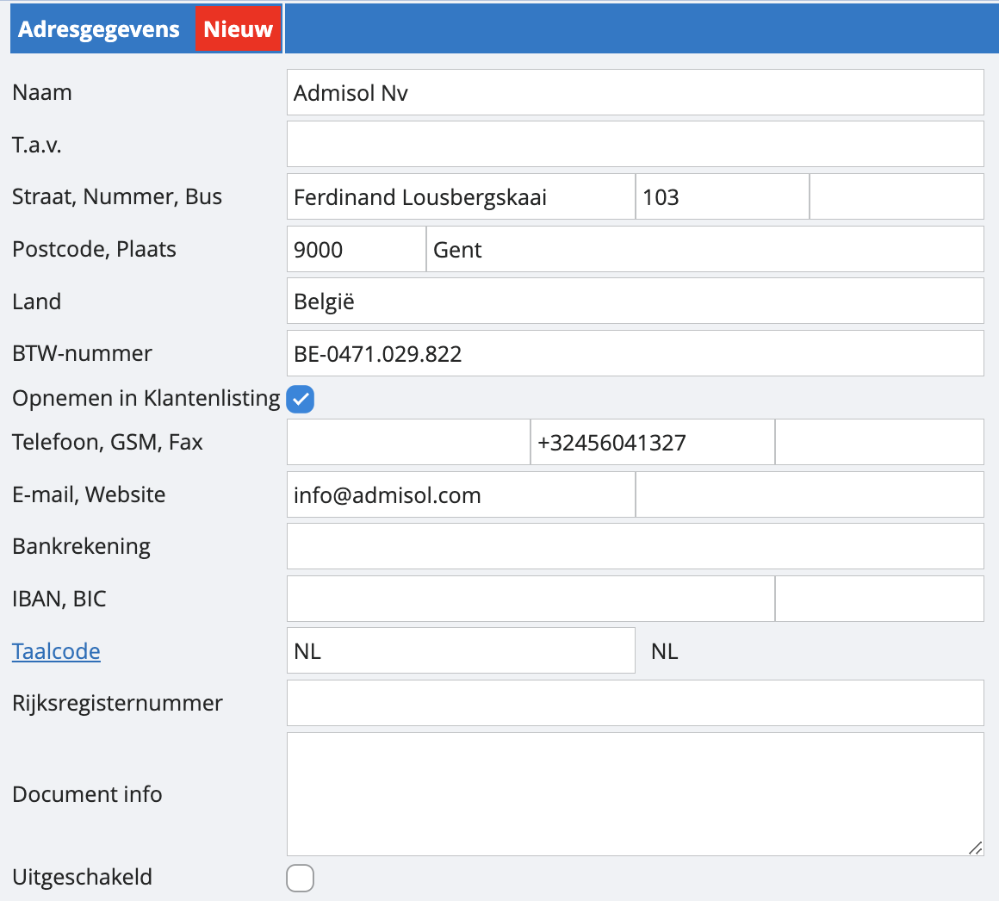
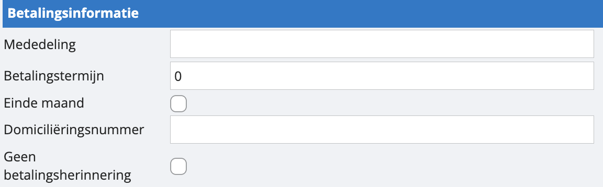
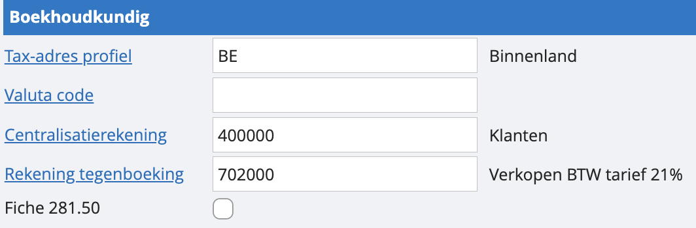
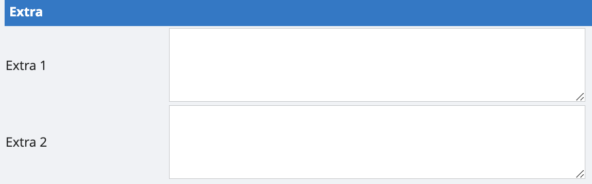
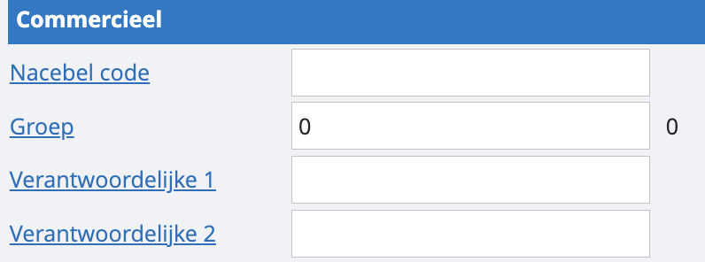
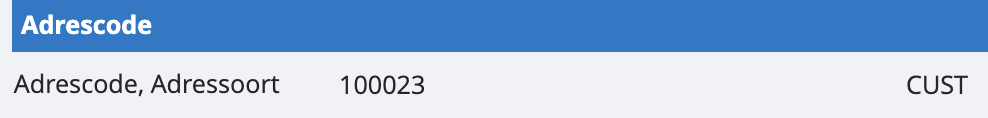

# Klanten- en leveranciersfiches aanmaken
In je lijst met klanten of leveranciers kan je op verschillende manieren sorteren, filteren en zoeken. Een klanten- of leveranciersfiche openen doe je door te dubbelklikken. Van hieruit kun je klantenfiches ook wijzigen. 

Maar hoe maak je nu een nieuwe klanten of leveranciersfiche aan? Je drukt op de groene plus bovenin het scherm. We overlopen het vervolgscherm: 

## Adresgegevens

<u>Naam</u>

Vul de naam van je klant in.

<u>T.a.v.</u>

Dit staat voor "ter attentie van". Je kunt hier een specifieke persoon vermelden. Je kunt ervoor kiezen om deze informatie al dan niet op te nemen in de lay-out van je facturen.

<u>Straat, Nummer, Bus, Postcode, Plaats</u>

Vul het adres van de klant in. Bij het invoeren van de postcode zal de plaatsnaam automatisch worden ingevuld. We controleren ook op duplicaten. Als je hetzelfde adres twee keer invoert, dan zal je hiervan een melding krijgen.

<u>BTW-nummer</u>

Voer het BTW-nummer van de klant in. Wij controleren de geldigheid van het nummer. Het systeem geeft ook een melding als het BTW-nummer al in je dossier voorkomt. Ondanks de melding kan je probleemloos meerdere fiches met hetzelfde BTW-nummer maken. 

<u>Opnemen in listing</u>

Als deze optie is aangevinkt, wordt de klant automatisch opgenomen in de BTW-listing - op voorwaarde dat er een geldig BTW-nummer is ingevuld.

<u>Telefoon en GSM</u>

De telefoon- en GSM-nummers worden automatisch geformatteerd volgens het internationale formaat.

<u>Bankrekening</u>

Voer je bankrekeningnummer in. We controleren de geldigheid. Mocht je eerst je IBAN invullen, zal dit veld ‘bankrekening’ automatisch worden aangevuld. 

<u>BIC, IBAN</u>

Als je IBAN aanvult, zal BIC ook automatisch worden ingevuld.

<u>Taalcode</u>

Als je de taalcode aanpast, wordt de lay-out van de facturen aangepast aan de geselecteerde taal. Bijvoorbeeld, als je de taalcode op "FR" zet, zullen de facturen in het Frans worden gegenereerd ipv het Nederlands.

<u>Document info</u>

Hier kun je een specifieke tekst vermelden die je op je facturen wilt zien voor deze klant.
Let op: om deze vermelding op de factuur te zien, moet je nog de nodige aanpassingen doen bij de lay-out.

## Betalingsinformatie

 

<u>Mededeling</u>

Dit is de standaardmededeling die wordt vermeld op de factuur of bij de betaalopdracht.

<u>Betalingstermijn</u>

Geef het aantal dagen op dat gebruikt wordt om de vervaldatum te berekenen.

<u>Einde maand</u>

Vink dit aan als de betalingsvoorwaarde "30 dagen einde maand" is. In instellingen, parameters van je dossier kan je ook meegeven dat je telt vanaf het einde maand, plus een aantal dagen. 

<u>Domiciliëring volmacht</u>

Koppel deze klantenfiche aan een eerder geregistreerde domiciliëringsvolmacht.
Domiciliëringsnummer

<u>Domiciliëringsnummer</u>

Voer het domiciliëringsnummer in dat je van de bank van deze klant hebt ontvangen. Dit wordt gebruikt wanneer je werkt met domiciliëring.

<u>Korting contant</u>

Geef het percentage korting op dat deze klant ontvangt bij contante betaling. Als dit een negatief getal is, wordt het een kredietbeperking.
*Let op: ‘korting contant’ en ‘kredietbeperking’ kunnen enkel gebruikt worden in combinatie met BTW-inclusief als de korting wordt ingevuld op de klantenfiche zelf.*

<u>Kortingsdagen</u>

Geef het aantal dagen op dat de korting contant of de kredietbeperking geldig blijft.

<u>Geen betalingsherinneringen</u>

Als je dit aanvinkt, wordt de klant niet meegenomen in de rappels.

## Boekhoudkundig

<u>Tax-adres profiel</u>
Hier selecteer je het type adres, zoals binnenlands-, medecontractant, EU, enzovoort. Deze instelling bepaalt hoe je facturen geboekt worden. Je kunt deze instelling altijd aanpassen per factuur op het moment van boeking.

<u>Valutacode</u>

Dit is de valutacode waarin je meestal transacties met deze relatie wilt boeken. Indien je dit leeg laat, zal de standaard valuta van het dossier gebruikt worden.

<u>Centralisatierekening</u>

Dit is de boekhoudkundige rekening waarop de verrichtingen gecentraliseerd worden: meestal 400000 voor klanten, 440000 voor leveranciers.

<u>Rekening tegenboeking</u>

Dit is de rekening die automatisch ingevuld wordt bij het boeken van een aan- of verkoopfactuur. Als je artikelen gebruikt, heeft het rekeningnummer op de artikelfiche voorrang op dit nummer. Tijdens het boeken kun je dit altijd overschrijven. Als je meerdere rekeningen nodig hebt, kun je deze instellen tijdens het boeken zelf met een standaardboeking. Meer weten over standaardboekingen? 

<u>Fiche 281.50</u>

Door dit aan te vinken, kan er automatisch een fiche aangemaakt worden voor alle boekingen waar zowel het adres als de rekening "fiche 281.50" is aangevinkt. Meer weten over de fiche 281.50? 

## Extra

Hier kan je vrij extra info meegeven over de klant of leverancier, dit verschijnt niet op de facturen. Kan gebruikt worden voor CRM-doeleinden. 

## Commercieel

<u>Groep</u>

Je kan klanten en leveranciers indelen in groep. Door op de link ‘groep’ te klikken kom je terecht in de lijst met alle aangemaakte klant- en leveranciersgroepen. Van hieruit kun je ook nieuwe groepen maken. 

<u>Verantwoordelijken</u>

Het is mogelijk om een gebruiker verantwoordelijk te stellen voor een klant of voor een leverancier.  Deze functie wordt voornamelijk gebruikt door accountantskantoren, maar kan ook gebruikt worden om verantwoordelijken toe te wijzen aan klanten of leveranciers binnen een bedrijf. Bij bepaalde lijsten kan er dan aangeduid worden om enkel de klanten of leveranciers te zien die onder de verantwoordelijkheid van een gebruiker vallen.

## Adrescode

De adrescode is de unieke code van een klant of leverancier. Je mag dit zien als een klant- of leveranciersnummer. Het wordt automatisch gegenereerd door ons, maar kan uitgeschakeld worden als u in de parameters “automatische sleutel” uitvinkt. 

Adressoort staat vast en kan niet aangepast worden.