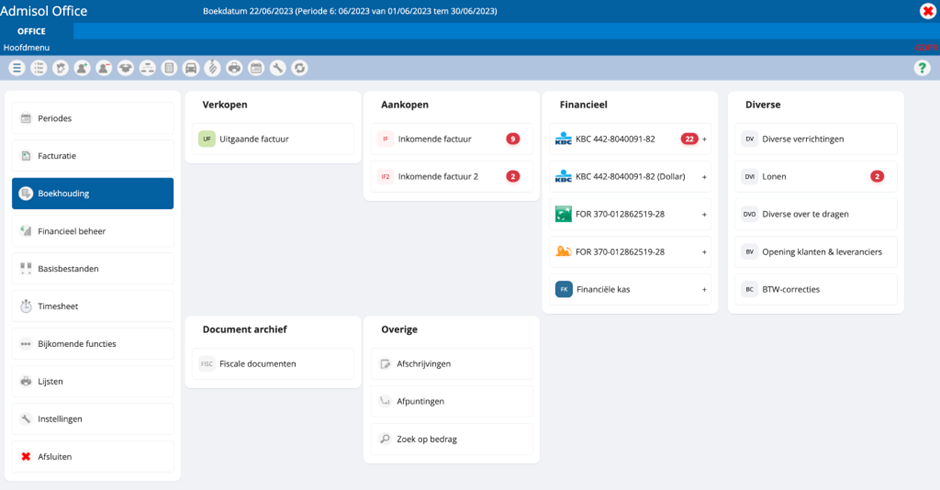

# Navigatie
Onze tool is 100% web-based, wat betekent dat er beperkingen zijn met betrekking tot het
gebruik van toetsenbordfuncties. De essentie is dat de meeste functies te vinden zijn in de
tool zelf, niet op het toetsenbord. Hierbij enkele belangrijke opmerkingen:

 Help: de functietoets F1 activeert de helpfunctie van je browser, niet de
helpfunctie van onze tool. Je moet hiervoor altijd het vraagteken-icoontje of
de sneltoetscombinatie Alt+H gebruiken. (CTRL, Option, H)

 Refresh: de F5-toets zal ervoor zorgen dat je webpagina vernieuwt. Binnen
onze tool kan je enkel refreshen door de toets links.

 Annuleren: hiermee ga je terug naar het vorige scherm zonder iets te
bewaren of te selecteren. Het is vergelijkbaar met het gebruik van de
escape-toets.

Daarnaast is het belangrijk om te weten dat bij het werken met een web-based applicatie
zoals de onze, het dubbelklikken anders werkt. In plaats van snel twee keer op een rij te
klikken, moet je eerst klikken om een item te selecteren, daarna om te activeren.
