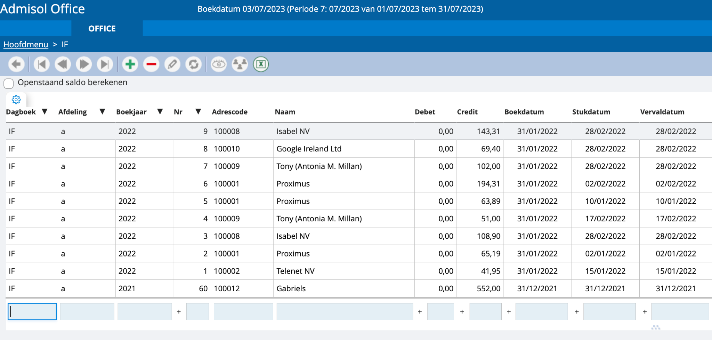
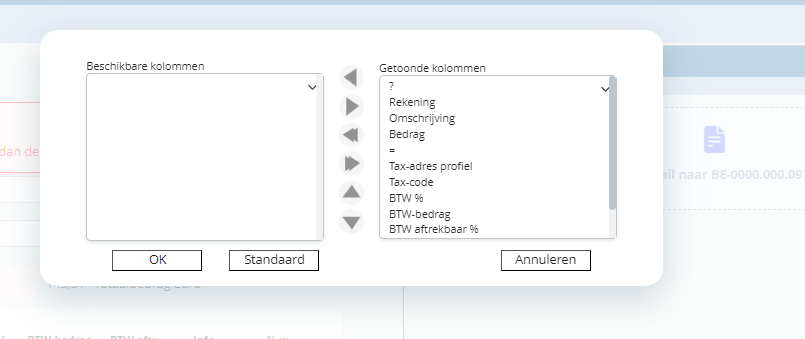
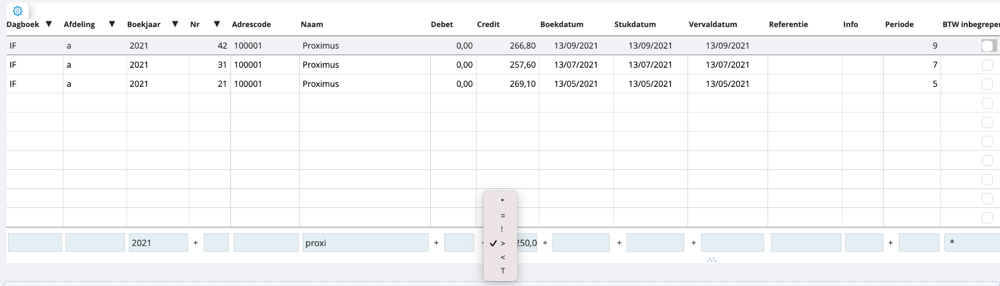

# Raster

In onze tool kom je vaak terecht bij rasters. We nemen hier even het voorbeeld van ons aankoopdagboek. Indien we vanuit het hoofdmenu via de boekhouding de inkomende facturen open, krijgen we dit te zien: 

We krijgen voor dit journaal een overzicht met alle boekingen. Het nieuwste document staat altijd bovenaan. In dit overzicht kun je eerdere boekingen opzoeken, eventueel ook nog aanpassen.

Toelichting van enkele basistoetsen

 Ga terug naar het vorige scherm

 Keer in het grid terug naar je recentste facturen

 Keer in het grid terug naar een vorig overzicht met recentere facturen

 Ga in het grid naar een volgend overzicht met minder recente facturen

 Ga in het grid naar de oudste facturen

 Boek een nieuw document

 Verwijder boeking – je moet er wel voor zorgen dat je nummering doorlopend blijft. Daarom kun je alleen het laatste document verwijderen, en alleen als je in een niet-afgesloten periode zit.

 Boeking opvragen – indien de gevraagde boeking in een afgesloten periode zit, kun je enkel opvragen, meer aanpassen. Als je in dat geval toch wijzigingen wilt maken, moet je een tegenboeking doen.

 Klik om een Excel-bestand te openen met de gegevens uit het raster

## Raster personaliseren 

Via het tandwieltje in het raster kun je aangeven welke velden je wil zien en in welke volgorde je ze wil zien. 

Bij getoonde kolommen gaan de kolommen bovenaan zichtbaar zijn uiterst links. De kolommen bij beschikbare kolommen zijn niet zichtbaar.

Dit is een instelling op gebruikersniveau. U kan dit dus zelf naar wens instellen zonder de instellingen van uw collega's aan te passen.

Bovendien kan je kolommen breder en smaller maken door in de titelbalk van het grid de grenslijnen te verslepen. 

## Filteren 

Stel, we zijn op zoek naar een specifieke factuur van Proximus. We kennen het factuurnummer niet, maar we weten dat het er eentje van 2021 moet geweest zijn en dat het bedrag hoger was dan €250.

    1. In eerste instantie filteren we op het jaar “2021”
    2. Vervolgens vernauwen we de filter door “proxi” te tikken
    3. Ten slotte kunnen we in de velden voor bedragen en data op “+” klikken om aan te geven welke range we willen zien: groter dan, kleiner dan, gelijk aan… 

Bij zowel bedragen, getallen als datums kan je deze geavanceerde filters gebruiken om waarden groter dan, kleiner dan, exact gelijk aan of niet gelijk aan te zoeken.

Als je exporteert naar Excel op het moment dat een filter actief is, zal enkel deze selectie worden geëxporteerd.

## Sorteren

In de titelbalk van het grid zie je pijltjes naar boven en naar beneden gericht. Dit geeft aan dat je alle kolommen van je grid kan sorteren, oplopend of aflopend. Je moet gewoon op de titel van de kolom klikken die je wilt sorteren.  