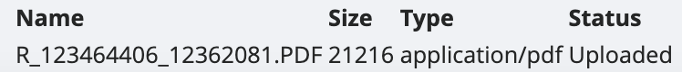

# Drag and drop

In verschillende dagboeken in onze tool kun je documenten aanbrengen. We openen in dit voorbeeld een aankoopdagboek en zien dit terug: 

De opdracht is eenvoudig. Je neemt het bestand vast dat je in onze tool wil opladen, je sleept het naar het veld binnen de stippellijn en laat het daarin vallen. 

*Let wel: het kan zijn dat de melding verschijnt dat het bestand te groot is. Dit kan je makkelijk verhelpen door in de parameters van je dossier de maximumlimiet van bestandsgrootte toe te staan. Meer weten over de maximumlimiet?*

*Let wel: in je aankoopdagboeken kan je standaard bestanden droppen. Wil je ook in andere dagboeken bestanden uploaden? Dat kan, maar dat moet je activeren in de instellingen, via dagboeken. Je opent het dagboek waarvoor je dit wil doen, en activeert de extra functie:*

Als het uploaden gelukt is, krijg je onder het veld om te droppen volgende melding: 

