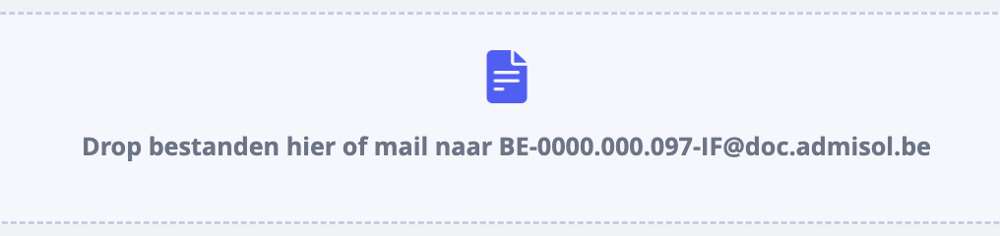

# Specifiek mailadres 

Verder krijgt ook ieder van onze klanten een specifiek mailadres toegewezen, dat je ook terugvindt in het veld om te droppen. Het is typisch gevormd door je BTW-nummer, de korte code van het dagboek waarnaar je wil sturen en een uitgang: 

Heb je een mail ontvangen van je leverancier met een factuur? Forward deze mail dan gewoon naar je mailadres, en het bestand dat erbij zit, zal worden opgeladen. 

*Let wel: deze mailfuncties moet je activeren voor ieder dagboek. Je moet in eerste instantie het opladen van externe documenten toestaan, zoals hierboven beschreven en vervolgens moet je via het groene vraagteken rechtsboven in de tool een bericht sturen naar de helpdesk om je mailadressen voor die dagboeken te activeren.*

*Let wel: je kan niet zomaar vanuit iedere bron facturen aanleveren in je dossier. In de parameters van je dossier kan je via het onderdeel ‘e-mail’ aanduiden vanuit welke bron de bestanden mogen worden aangeleverd. Meer weten over parameters?*

*Tip: wil je een extra mailadres toevoegen van waaruit je facturen kan doorsturen per mail? Doe dat via ‘basisbestanden’, dan ‘contacten’. *