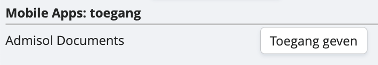

# Mobiele applicatie

Ten slotte is er nog de derde manier om facturen aan te leveren, en dat is via de fotofunctie in onze mobiele applicatie. Admisol Documents heet die, en die is te vinden op de Google Playstore en de App Store. Heel handig voor aankoopbonnetjes of andere kleine BTW- documenten, die je anders riskeert te verliezen. 

*Let wel: inloggen in de app doe je met je gewone gebruikersnaam en wachtwoord. Je moet hier wel expliciet vanuit je centrale dossier toegang toe geven. Dit doe je door via ‘instellingen’, ‘dossierinstellingen’, naar ‘gebruikers’ te gaan. Je dubbelklikt vervolgens op de gebruiker die je toegang wil geven, en klikt onderaan:*

