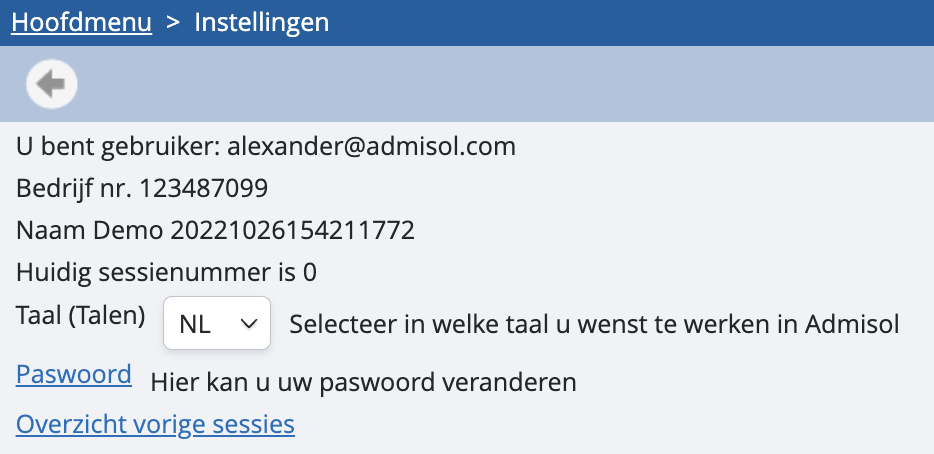

# Hoe verander ik mijn wachtwoord? 

Als je je wachtwoord wilt wijzigen, ga dan naar instellingen. Onderstaand scherm opent: 

Klik op de onderstreepte link ‘paswoord’: hier kun je je wachtwoord wijzigen. Voer twee keer je nieuwe wachtwoord in van minimaal acht tekens.

Als je je wachtwoord bent vergeten, kun je bij het inloggen gewoon klikken op ‘wachtwoord vergeten’. Met een sms-code zal je je wachtwoord opnieuw kunnen instellen. 